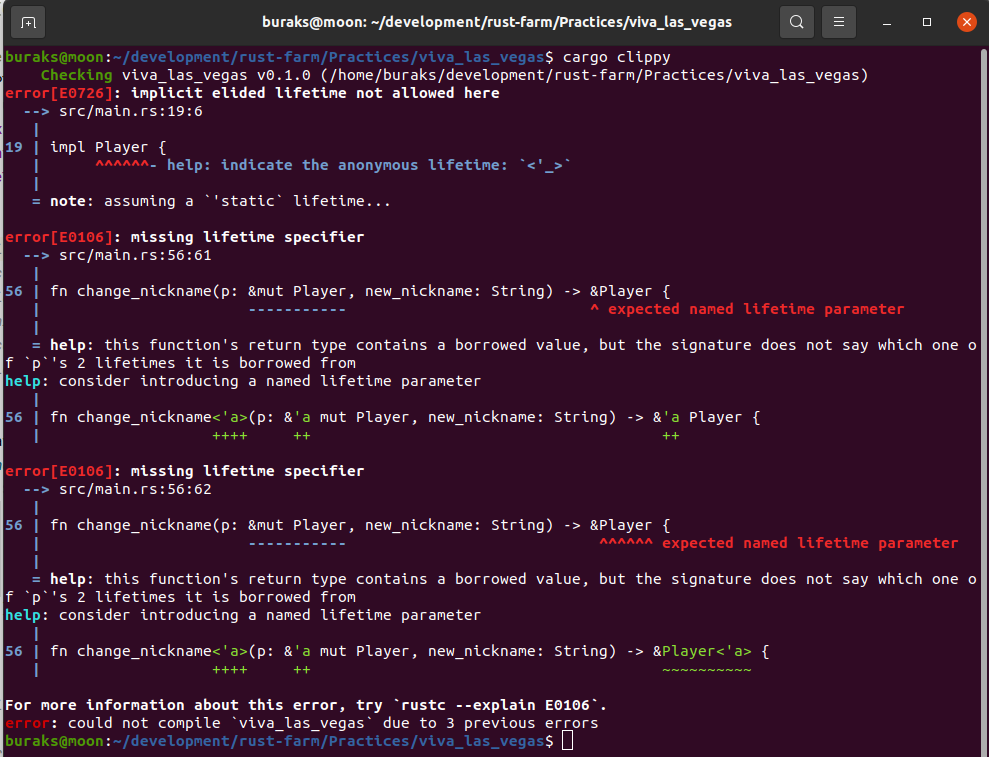
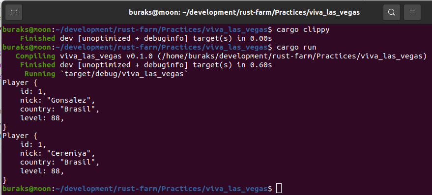

# Lifetimes Mevzusu

Rust'ın özellikle Garbage Collector kullanılan dillerden çok farklı olduğunu bellek yönetimi için getirdiği kurallardan dolayı biliyoruz. Ownership, borowwing gibi hususlar sayesinde güvenli bir bellek ortamını garanti etmek üzerine ihtisas yapmış bir dil. Bunlar pek çok dilde otomatik yönetildiği için Rust'ı öğrenmek zaman alabiliyor. Zor konulardan birisi de Lifetimes mevzusu. Bu konuyu esasında 45 Byte sohbetlerinde dile getirmek istiyorum. Lakin çok basit bir örnek gerekiyor. viva_las_vegas bu amaçla yazıldı.

```shell
# Önce projemizi bir oluşturalım
cargo new viva_las_vegas
cd viva_las_vegas
cargo clippy
cargo run
```

Senaryomuz bir oyuncuyu temsil eden veri modelinin tasarlanması ile başlıyor. Bu haliyle gayet güzel çalışmakta.


Sonrasında senaryoya oyuncunun nickname bilgisini değiştirecek bir fonksiyon _(change_nickname)_ dahil eidliyor. Bu durumda da kod beklediğimiz şekilde çalışıyor.


Aslında Player değişkenindeki String içerikler literal türden de tanımlanabilirler. String veri türü heap alanını kullanan ve genişleyebilen bir yapıdadır. Stack'te Heap'teki metinsel alanı işaret eden, pointer ve referans adresi gibi bilgileri tutar. Ancak en nihayetinde onun için bir allocation söz konusudur. str literal ise String veri türünün olduğu bellek bölgesinin bir parçasını _(metnin bir kısmını mesela)_ referans eder ve sabit uzunluktadır. Yani String'ten çekildikten sonra değiştirielemez. Metinsel bilginin değişmeyeceği durumlarda literal kullanmak da oldukça mantıklıdır. O halde gelin Player veri yapısında nick ve country alanlarını literal string'e çevirelim. Ardından programı clippy ile bir kontrol edelim.


Upss!!! Bir sürü hata aldık :( nick ve country alanları literal string türünden. Player'ın kullanıldığı scope'lar düşünüldüğünde deallocate edilmesi sonrasında olmayan bellek alanlarını referans eden pointer'lar haline gelebilirler. Bu durumun oluşmaması için Rust söz konusu alanların ne kadar süre yaşayacağını bilmek istiyor. Böylece _Dangling Pointer_ durumunun oluşmasının önüne geçmiş oluyoruz. Bunun üstüne ilk olarak derleyicinin de önerdiği üzere Player için gerekli lifetime parametrelerini ekleyelim. Sonrasında programa clippy ile tekrar bakalım. 



Hobaaa!!! İşler daha da kötüye gitti sanki :D Hata mesajlarını ve uyarıları okursak işimizin daha kolay olduğunu görebiliriz. Player nesnesindeki literal string alanları için lifetime belirttiğimiz anda, Player'ın kullanıldığı ne kadar scope varsa onlar için de kullanım sürelerini belirtmemiz gerekecektir. Bu örneğe göre new ve change_nickname fonksiyonları Player türü ile çalışmakta. Dolayısıyla bu fonksiyon scope'larının stack bellek bölgesinde kaldığı süre doğal new ve change_nickname parametreleri için de geçerli olmalı. Öyle ki dışarıdaki bir Player nesnesi ne kadar süre yaşayacaksa parametreler de aynı sürelerde hayatta kalsınlar. Player deallocate olduğunda ise onlar da yok edilsinler. Kodu buna göre düzelttikten sonra sonuca tekrar bakalım.

Lifetime parametrelerini doğru bir şekilde verdikten sonra kod çalışır hale gelecektir.



Tekrar hatıralayım. String heap'de duran, UTF8 formatındaki bir veri tipidir ve bulunduğu yere erişebiliriz. Onun için heap'te bir yer ayrılır _(allocation)_ &str ise bir parça dilimdir _(slice type)_ Yani zaten var olan bir String'in bir parçasını işaret eder ve çalışma zamanıdan herhangi bir allocation gerektirmez. Sabit uzunlukta olan &str yeniden boyutlandırılamaz.

