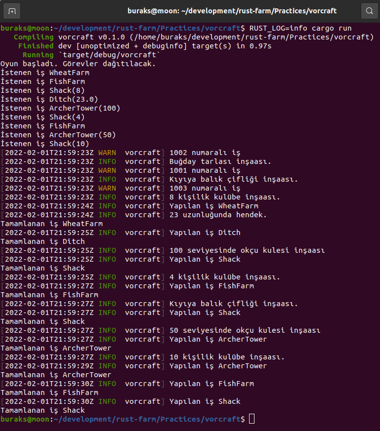

# Crossbeam ile Kanal(channel) Kullanımı

Thread'ler aralarında haberleşmek için kanallardan(channels) yararlanır. Genellikle rust'ın built-in modüllerinden olan mpsc(multi-producer single-consumer) paketi kullanılır. Bu paket aslında FIFO(First-In First-Out) ilkesine göre çalışan tipik bir kuyruktur. İki thread arasında açılan bir kanalda tek yönlü olarak mesaj göndermek mümkündür. Böylece bir thread'den diğerine çeşitli verileri aktarabiliriz. Burada akan veri türleri Send trait'ini uygulamalıdır. Primitive tiplerin hepsi bu davranışa sahiptir. Kanallarla ilgili olarak dikkate değer bir diğer konu da türleridir. Bounded ve Unbounded olmak üzere iki seçenek vardır. Bounded kanallarda kapasite bellidir. Bir başka deyişle bir thread'den diğerine veri taşımak için kullanılan kanalın kapasitesi sınırlandırılır. Eğer kanal kapasitesi dolarsa, yayın yapan thread doğal olarak bloklanır. Unbounded kanallarda ise bir kapasite sınırı yoktur. Bellek yetersiz olana ya da sistem bir şekilde çökene kadar kanal kullanılabilir. Kanalların bu iki türünün farklı sayıda alıcı ve yayıncıları olabilir. Örneğin tek bir yayıncının birden çok alıcısı olabilir ve kanala atılan veri bunlardan herhangi birisi tarafından işlenir. Bu senaryoda kanaldaki veriyi hangi thread'in alacağı ise belirsizdir. Çok doğal olarak birden çok yayıncı thread'de olabilir. Bu sefer hangi mesajın kanala ilk sırada gireceği konusu ortaya çıkar ki kural basittir; ilk bırakanın ki ilk gider. Esasında kanalların her iki yönünde de birden çok taraf olabilir. Buna göre aynı t anında çalışan birden çok yayıncı ve alıcı thread mümkündür. Tabii bahsettiğimiz bu senaryolarda kanallar hep tek yönlüdür. Yani yayıncı taraftan alıcı tarafa doğru kurulan bir iletişim hattı söz konusudur. Aksi mümkün müdür? Elbette... Pekala ayrı kanallar açarak thread'ler arasındaki iletişimi çift yönlü kanallar üzerinden de sağlayabiliriz. Ancak bu kullanımda deadlock oluşturma ihtimalimiz vardır. Örneğin bounded kanalları kurduğumuz ve verinin döngüsel bir akış içerisinde yer aldığı bir senaryoda tarafların birbirini beklemesi söz konusu olabilir ki bu da deadlock durumunun oluşmasına davetiye çıkarır. Bu teorik bilgiler bazen can sıkıcı olabiliyor. İyisi mi Rust Pratikleri'nin bu bölümüne kolay bir örnekle devam edelim.

Amacımız Rust'ın kanal kullanımlarında öne çıkan kütüphanelerinden crossbeam sandığını kullanarak basit bir senaryoyu işletmek. Örnekte bir simülasyon oyunundaki işçilere çeşitli görevler atayacağız ve thread'ler arasındaki iletişim için bir kanal kurgusunu nasıl tesis edebileceğimize bakacağız.

```shell
cargo new vorcraft
cd vorcraft
touch src/lib.rs

cargo clippy
cargo run

# logları da görmek için
RUST_LOG=info cargo run
```

İşte çalışma zamanı çıktısı.

