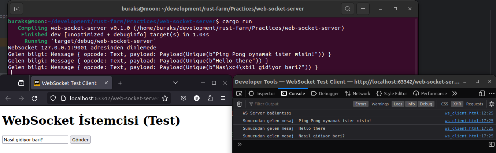

# Tokio ile Web Socket Sunucusu Yazmak

Asenkron ağ haberleşmesi denince Rust tarafında defacto olmuş crate'lerden tokio ilk akla gelenlerden. Tokio'yu ve Rust'ın verimliliğini bir araya getirip basit bir web-socket sunucusu yazabiliriz. Bu çalışma, web socket protokolüne göre çalışan bir sunucuyu Rust ile nasıl yazabileceğimizi öğrenmek açısından iyi bir pratiktir.

WebSocket'ler istemci ve sunucu arasında gerçek zamanlı _(real-time)_ iletişim kurulmasında kullanılan standartlardan birisidir. Hatta Microsoft SignalR, WebSocket'i sarmallayan bir üst katman olarak düşünülebilir. Chat uygulamaları, oyunlar, canlı spor müsabakası güncellemeleri veya finansal piyasa hareketlerinin anlık takibi gibi iki yönlü iletişimin _(two way communication)_ öne çıktığı vakalarda tercih edilmektedir.

Bu protokelde sunuculara ws veya wss _(güvenli olan versiyonu. https gibi düşünebiliriz)_ başlıklı adreslerden erişilir. Full-Duplex iletişime imkan tanır. İstemci ve sunucu arasındaki haberleşme bir tokalaşma _(handshake)_ ile başlar. Aslında burada istemci bir HTTP talebinde bulunur ve WebSocket haberleşmesi gerçekleştirmek istediğini belirtir. Sonrasında server web socket desteği veriyorsa veri alışverişi başlar. 

HTTP'nin aksine WebSocket iletişiminde bağlantı sürekli açık kalır, veri stream olarak değil mesaj tabanlı hareket eder.

Örnekte kullanılan küfeler için toml içeriği şu şekildedir.

```toml
[dependencies]
tokio = { version = "1.28.1", features = ["full"] }
tokio-websockets = { version = "0.5.1", features = ["client", "fastrand", "server", "sha1_smol"] }
futures-util = { version = "0.3.30", features = ["sink"] }
```

## Test

Sunucu çalışır haldeyken web socket sunucusuna mesaj gönderen html sayfası açılıp test edilebilir.

