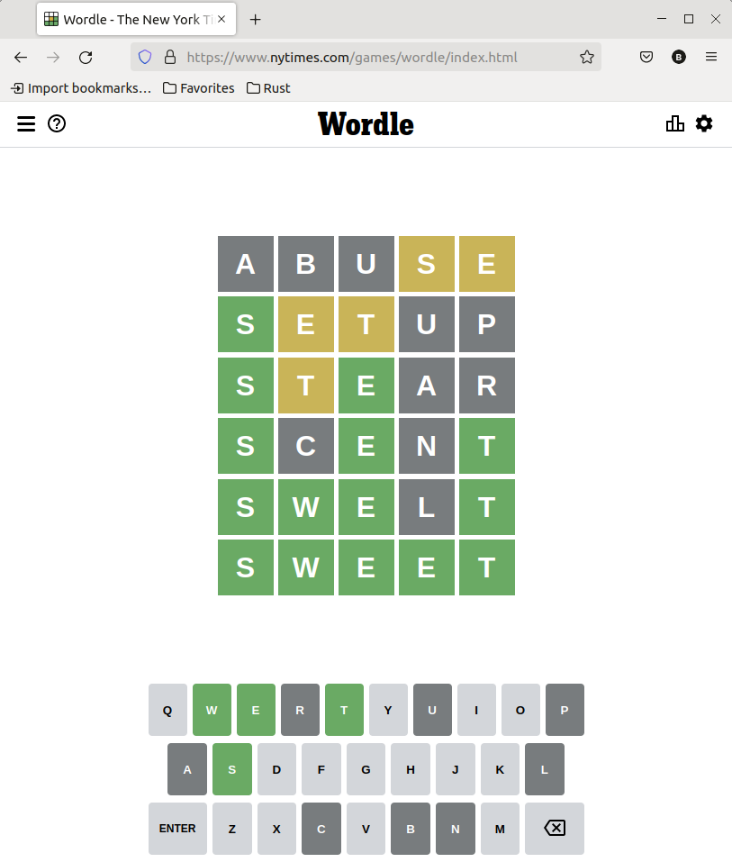

# Wordle Oyununun Rust ile Yazılması

Mobil oyunlarla çok fazla arama yok ancak nasıl yazıldıklarını merak ediyorum. Geçtiğimiz günlerde The Pragmatic Programmers mecrasından Herbert Wolverson'un Wordle isimli popüler bir oyunun Rust ile nasıl yazılacağını anlattığı [şu yazısına](https://medium.com/pragmatic-programmers/rustle-5c15d1c153a1) denk geldim. E boş durur muyum? Adım adım tatbik etmeye karar verdim. Nitekim bu yolculuk Rust ile ilgili birçok şey öğretecekti. Bu yazıda izlediğim adımları ve kendi yorumlarımı bulabilirsiniz.

Öncelike Wordle oyunu nasıl bir şey anlamak lazım. Google Play veya App Store'dan indirebileceğimiz oyunun Huawei App Gallery'de bir karşılığını bulamadım ama benzerleri vardı. Önce oynamalıydım ki nasıl bir şey olduğunu anlayayım. Düşündüren bir kelime oyunu olduğunu ifade edebilirim. Hatta isterseniz Neywork Times'ın [şu adresinden](https://www.nytimes.com/games/wordle/index.html) online bir versiyonunu deneyebilirsiniz. Hatta kendi denememden bir örnek vererek oyunu anlatsam daha iyi olabilir



Oyun sayası 5 sütün ve 6 satırdan oluşuyor. İlk satıra _(en üst satır)_ 5 harfli ve anlamlı bir kelime yazarak başlıyorsunuz. Program kelimenize bakıp harflerin doğru olup olmadığını kontrol ediyor. Eğer harf tam da yerindeyse yeşil renge boyuyor. Harf doğru ama yeri yanlışsa sarı renge boyuyor. Eğer harf programın tuttuğu kelimede yoksa gri olarak boyanıyor. Bunun üzerine ipuçlarını takip edip ikinci satıra geçiyoruz. Ben ilk satırda S ve E harflerini tutturdum ama yerleri yanlıştı. İkinci denemede ise büyük bir şans eseri birinci harfi tam da yerinde bildim. Ancak E ve T harfleri halen yanlış yerdeydi. Sonuç olarak 6ncı seferde SWEER kelimesini bulmayı başardım. Şimdi Herbert'e kulak verelim. Bakalım neler neler yapacağız? :)

```shell
# Önce projeyi oluşturuyoruz elbette
cargo new wordle
```

Programda yardımcı crate'ler kullanılıyor. Pek çok rust öğretisinde rastgele sayı üretmek için rand paketi kullanılıyor. Bu örnekte ise bracket-random isimli bir paket kullanılmakta. Ayrıca terminal penceresini renklendirmek için _(ki bayılırım buna)_ colored isimli bir modülden yararlanılmakta. Bu paket bildirimlerini tahmin edileceği üzere toml dosyasına eklememiz lazım.

```toml


```