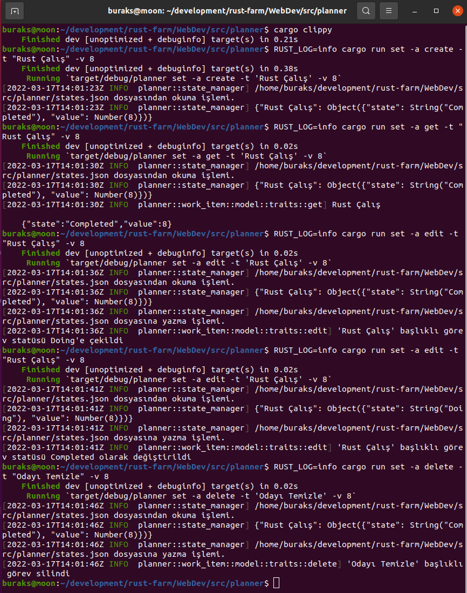

# Örnek Web Uygulaması

Rust, programlama dilleri piramidi düşünülünce C ve C++ ile aynı seviyede yer alan bir sistem programlama dili esasında. Ancak sunduğu bellek güvenliği garantili yüksek performans ve minimal kaynak tüketimi düşünülünce bir web uygulamasının ana motorunu yazmak için de tercih edilebilir. Rust ile web programlamanın nasıl yapıldığını öğrenmek için **Maxwell Flitton** tarafından yazılmış **Packt** yayınlarından **[Rust Web Programming](https://www.amazon.com/Rust-Web-Programming-hands-programming/dp/1800560818)** kitabını takip ediyorum. Burada yer alan planner isimli projeyi bu kitaptan öğrendiklerimle yazmaya çalışmaktayım.

Uygulama basit bir todo klonu. Kişisel planlamalarımıza dahil edeceğimiz isteklerimizi ready, doing, done gibi statülerle ele alıyoruz. Bu işi yürütecek bir web arabiriminin peşindeyiz. Kişisel bir kanban olarak düşünebiliriz.

- [x] Gün #1 - Projenin temel veri yapılarının oluşturulması.
- [ ] Gün #2 - 
- [ ] Gün #3 - 
- [ ] Gün #4 -
- [ ] Gün #5 -
- [ ] Gün #6 -
- [ ] Gün #7 -

# Gün 1 Denemeleri

```bash
# states.json'a Ready statüsünde yeni bir work item eklemek için
RUST_LOG=info cargo run set -a create -t "Rust Çalış" -v 8
# Var olan work item'ı çekmek için
RUST_LOG=info cargo run set -a get -t "Rust Çalış" -v 8
# Ready statüsünde olan bir work item'ı doing'e çekmek için
RUST_LOG=info cargo run set -a edit -t "Rust Çalış" -v 8
# ve Doing statüsünden Completed'a çekmek için tekrardan
RUST_LOG=info cargo run set -a edit -t "Rust Çalış" -v 8
# Var olan bir work item'ı silmek için
RUST_LOG=info cargo run set -a delete -t "Odayı Temizle" -v 8
```



