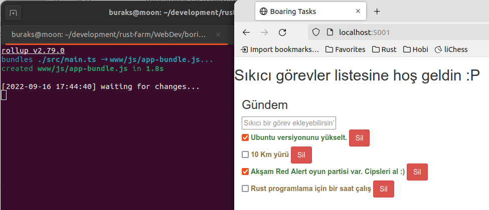

# Boring Todo App

Backend tarafında Rust'ın kullanıldığı bir Todo uygulaması esasında. Program PostgreSQL veritabanını kullanmakta. Benim gibi sistemine PostgreSQL veritabanını yüklemek istemeyenler pekala docker imajlarından yararlanabilirler. Bunun için aşağıdaki komutlar yeterli olacaktır.

```shell
docker run --rm -p 5432:5432 -e "POSTGRES_PASSWORD=scoth_tiger" --name pg postgres:14.5
```

Ben sistemimde daha önceden yüklemiş olduğum postgresql imajını kullanıyorum. Örneğin ilk kısmında kod tarafındaki bazı script dosyalarını kullanarak veri tabanı, tablo ve örnek verilerin oluşturulması işlemleri söz konusu. Oluşan görüntü ilk etapta tatmin edici.


Frontend tarafını geliştirmeye başladıktan sonra web projesini çalıştırmak için backend klasöründeyken aşağıdaki terminal komutu kullanılır.

```shell
cargo run ../webapp/www
```

Kodlamamıza göre bu http://localhost:5001 adresini etkinleştirecektir. Buna aşağıdaki gibi bir sonuç elde edebiliriz. Başlangıç için hiç fena değil. Rust ile web sunucusunu warp ve tokio paketlerini kullanarak başlattık ve statik bir html içeriğini sunduk.


İlerleyen kısımlarda buraya görevler listesine ait CRUD operasyonları için gerekli önyüz düzenlemelerini ekleyeceğiz.

Web API tarafının testleri için backend uygulamasını çalıştırdıktan sonra Postman ile bazı denemeler yapabiliriz.

İlk denemede Header'da Token bilgisi kullanmadan ilerliyoruz. Buna göre tasarladığımı hata mesajının dönmesi gerekiyor.


Eğer token bilgisi kullanırsak aşağıdaki ekran görüntüsünde olduğu gibi başarılı bir sonuç alabiliriz.


HTTP Post üstünden yeni görev eklenmesine ait örnek;


HTTP Patch ile az önce eklenen görevin durumunun güncellenmesine ait örnek;


## Web Uygulaması

Web uygulamasında typescript kullanılıyor. Gerekli node paketlerini de aşağıdaki gibi yükleyebiliriz.

- __rollup__ Javascript tarafı için geliştirilmiş bir Module Bundler sistemidir. Küçük kod parçalarını kütüphane şeklinde daha büyük modüllere derlemek için kullanılır. 
- __@rollup/plugin-commonjs__ CommonJS modüllerini ES6 formatına çevirir ki Rollup Bundle ile birlikte kullanılabilsinler.
- __@rollup/plugin-node-resolve__ Nore Resolution algoritmasına göre node_modules altındaki üçüncü parti modüllerin yerleştirilmesine kullanılan Rollup eklentisidir.
- __@rollup/plugin-typescript__ Rollup ile Typescript arasındaki entegrasyonda kullanılır.
- __rollup-plugin-terser__ Rollup Bundle'ı ufalamak(minify) için kullanılır.

```shell
sudo npm install @rollup/plugin-commonjs @rollup/plugin-node-resolve @rollup/plugin-typescript rollup-plugin-terser rollup --save-dev

sudo npm install dom-native

# Web tarafını deneme amaçlı ayağa kaldırmak için
npm run build -- -w

# Üstteki komut çalıştırıldığında kod değişiklilerinin son hallerini içeren bir paket oluşur
# js klasöründe index.html'in kullandığı bundle dosyalarına dikkat edelim.
# sonrasında backend tarafında aşağıdaki komut ile sunucuyu etkinleştirebiliriz.
cargo run ../webapp/www
# Ardından http://localhost:5001/ adresine gitmemiz yeterli.

# Eğer
# [!] (plugin typescript) Error: @rollup/plugin-typescript: Could not find module 'tslib', which is required by this plugin. Is it installed?
# şeklinde bir hata alırsak tslib sistemde yüklü olmadığı içindir.
# Aşağıdaki komut ile bunu yükleyebiliriz.
sudo npm i -D tslib
```

Tüm listeyi çeken web çağrı metodunu view'a ilk eklediğim gün elde ettiğim ekran görüntüsü aşağıdaki gibi.



En son olarak geldiğimiz noktada görev ekleme, silme ve güncelleme işlemlerini gerçekleştirebilmekteyiz.

