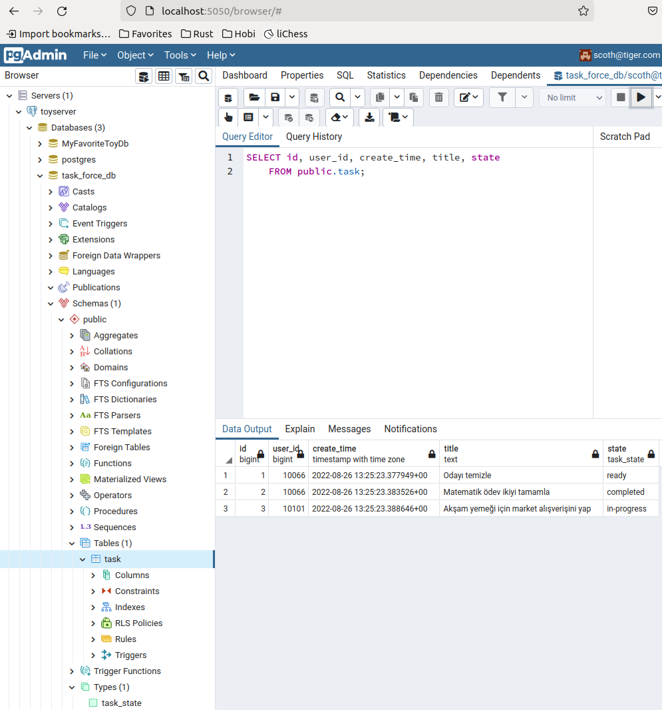
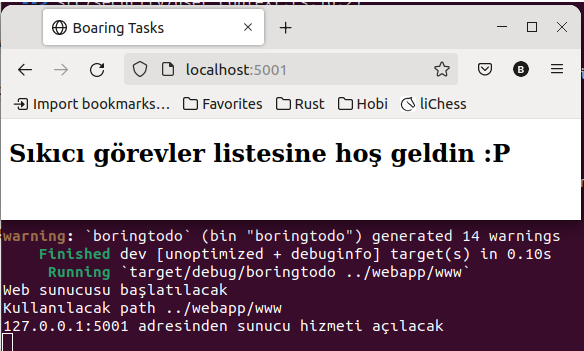
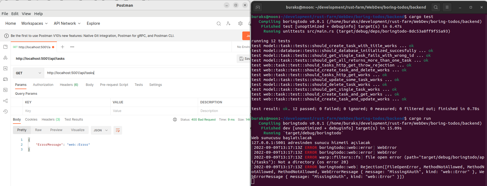
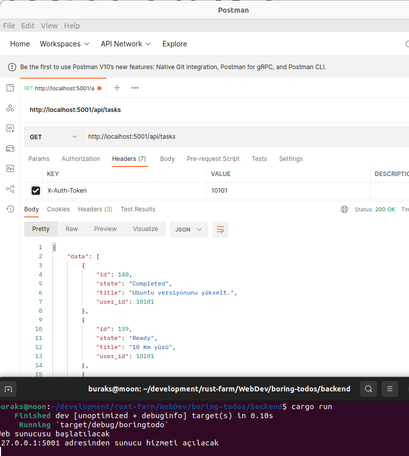
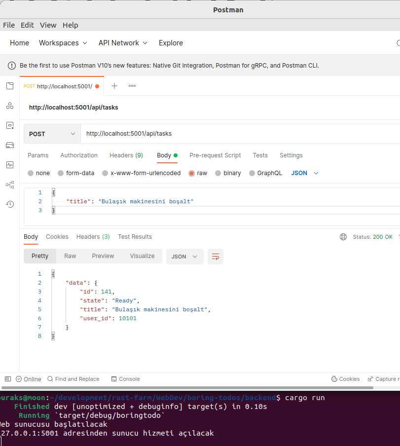
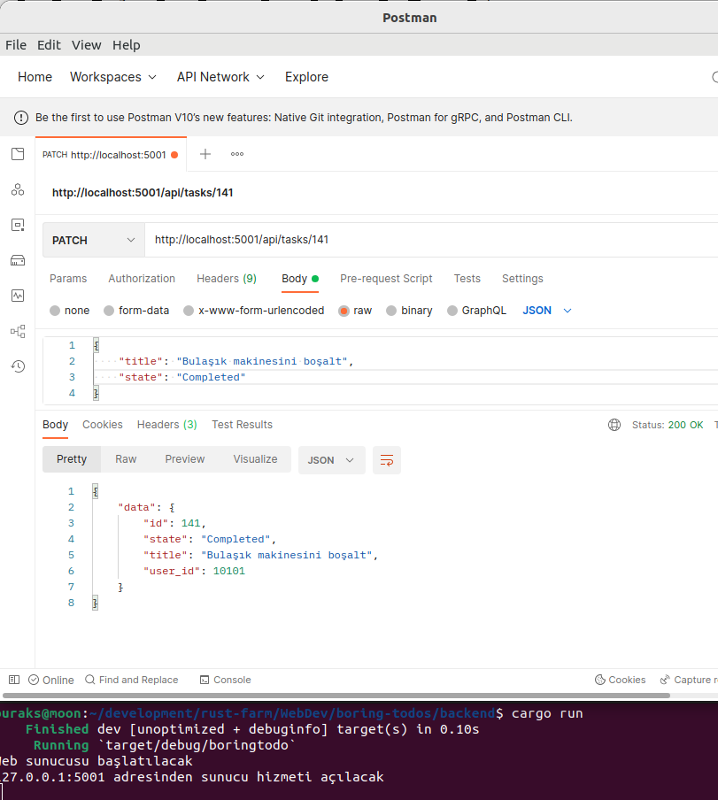

# Boring Todo App

Backend tarafında Rust'ın kullanıldığı bir Todo uygulaması esasında. Program PostgreSQL veritabanını kullanmakta. Benim gibi sistemine PostgreSQL veritabanını yüklemek istemeyenler pekala docker imajlarından yararlanabilirler. Bunun için aşağıdaki komutlar yeterli olacaktır.

```shell
docker run --rm -p 5432:5432 -e "POSTGRES_PASSWORD=scoth_tiger" --name pg postgres:14.5
```

Ben sistemimde daha önceden yüklemiş olduğum postgresql imajını kullanıyorum. Örneğin ilk kısmında kod tarafındaki bazı script dosyalarını kullanarak veri tabanı, tablo ve örnek verilerin oluşturulması işlemleri söz konusu. Oluşan görüntü ilk etapta tatmin edici.



Frontend tarafını geliştirmeye başladıktan sonra web projesini çalıştırmak için backend klasöründeyken aşağıdaki terminal komutu kullanılır.

```shell
cargo run ../webapp/www
```

Kodlamamıza göre bu http://localhost:5001 adresini etkinleştirecektir. Buna aşağıdaki gibi bir sonuç elde edebiliriz. Başlangıç için hiç fena değil. Rust ile web sunucusunu warp ve tokio paketlerini kullanarak başlattık ve statik bir html içeriğini sunduk.



İlerleyen kısımlarda buraya görevler listesine ait CRUD operasyonları için gerekli önyüz düzenlemelerini ekleyeceğiz.

Web API tarafının testleri için backend uygulamasını çalıştırdıktan sonra Postman ile bazı denemeler yapabiliriz.

İlk denemede Header'da Token bilgisi kullanmadan ilerliyoruz. Buna göre tasarladığımı hata mesajının dönmesi gerekiyor.



Eğer token bilgisi kullanırsak aşağıdaki ekran görüntüsünde olduğu gibi başarılı bir sonuç alabiliriz.



HTTP Post üstünden yeni görev eklenmesine ait örnek;



HTTP Patch ile az önce eklenen görevin durumunun güncellenmesine ait örnek;



...