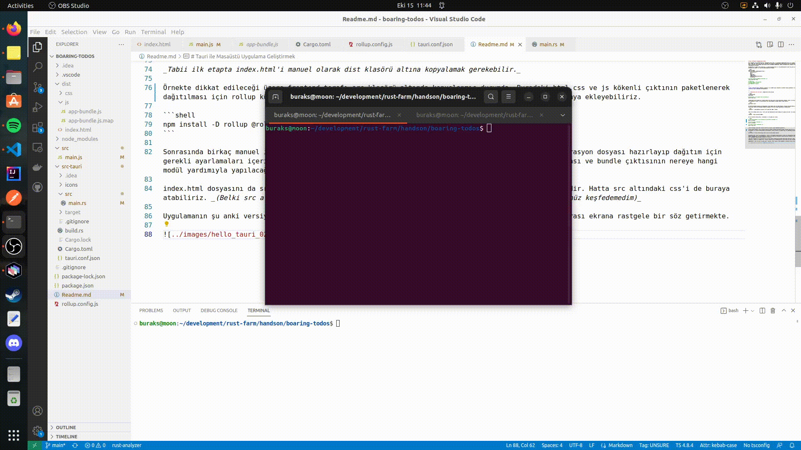

# Tauri ile Masaüstü Uygulama Geliştirmek

Rust tarafında cross-platform masaüstü uygulamalar geliştirmek için kullanılan paketlerden birisi [tauri](https://tauri.app/). Teori oldukça basit. HTML, CSS, Javascript gibi önyüz tarafını inşa etmekte kullanılabilecek enstrümanları arka plan kodlamasının yapıldığı Rust ile uyumlu halde çalıştırmak. Ben denememi kendi Ubuntu 22.04 sistemimde yapmaktayım. Deneme sonrasında önreği Windows ve MacOS işletim sistemlerinde çalıştırmak da istiyorum.

Sistemde Rust ve nodejs yüklü ancak Tauri için bazı ön gereksinimler var. Bu gereksinimlerin neler olduğunu öğrenmek ve sistemime nasıl yükleyeceğimiz görmek için resmi dokümantasyondan yararlandım.

```shell
sudo apt update
sudo apt install libwebkit2gtk-4.0-dev \
    build-essential \
    curl \
    wget \
    libssl-dev \
    libgtk-3-dev \
    libayatana-appindicator3-dev \
    librsvg2-dev
    
# Projeyi scaffold yardımıyla oluşturmak için
cargo create-tauri-app

# Örnek için
# Project Name -> boaring-todos
# Package Manager -> npm
# UI Template -> vanilla
```

---

**cargo create-tauri-app** komutunun çalışması için sistemde ilgili template'in yüklenmiş olması gerekebilir. Bunun içinde **cargo install create-tauri-app** komutundan yararlanılabilir.

---


```shell
cd boaring-todos
npm install

# Çalıştırmak için aşağıdaki komut kullanılabilir.
npm run tauri dev
```

Örnekte geliştirme ortamına ait çalışma zamanı local http server olarak kullanılmak isteniyor. Bunun için servor isimli node paketinden yararlanılmakta. Kurmak için boaring-todos root klasöründeyken aşağıdaki komutu vermek yeterlir.

```shell
npm install servor
```

Bu işlem sonrasında package.json dosyasındaki script kısmına yeni bir komut eklenir. Bu komut hotreload özelliğini etkinleştirecektir ve dist klasöründeki index.html dosyasında yapılan herhangibir değişiklik anında uygulamaya da yansıyacaktır.

```text
"localhost":"./node_modules/.bin/servor dist index.html 8080 --reload"
```

Tabii bu tek başına yeterli değil. tauri.conf.json dosyasında da build sekmesine aşağıdaki key:value çifti eklenir.

```text
"devPath": "http://localhost:8080/",
```

Bu değişiklikler sonrası örneği çalıştırmak için aşağıdaki yol izlenir.

```shell
# root klasöründeyken
npm run localhost

# src-tauri klasörü altındayken ise
npm run tauri dev
```

_Tabii ilk etapta index.html'i manuel olarak dist klasörü altına kopyalamak gerekebilir._

Örnekte dikkat edileceği üzere frontend tarafı src klasörü altında konuşlanmış durumda. Buradaki html,css ve js kökenli çıktının paketlenerk dağıtılması için rollup kütüphanesinden yararlanılıyor. Gerekli modülleri aşağıdaki komut ile uygulamaya ekleyebiliriz.

```shell
npm install -D rollup @rollup/plugin-node-resolve @rollup/plugin-commonjs
```

Sonrasında birkaç manuel işlem gerekebilir. Örneğin root klasörde rollup.config.js isimli bir konfigurasyon dosyası hazırlayıp dağıtım için gerekli ayarlamaları içerisine eklemeliyiz. Özetle bu konfigurasyon dosyasında kaynak Javascript dosyası ve bundle çıktısının nereye hangi modül yardımıyla yapılacağı gibi bilgilere yer verilir.

index.html dosyasını da src klasöründe değil de dist klasörü altında geliştirmeye devam etmek yeterlidir. Hatta src altındaki css'i de buraya atabiliriz. _(Belki src altından dist içerisine otomatik olarak taşınmalarının bir yolu vardır ama henüz keşfedemedim)_

Uygulamanın şu anki versiyonu aşağıdaki gibi çalışmakta. Basit toplama işlemi yapmakta ve tıklama sonrası ekrana rastgele bir söz getirmekte.

