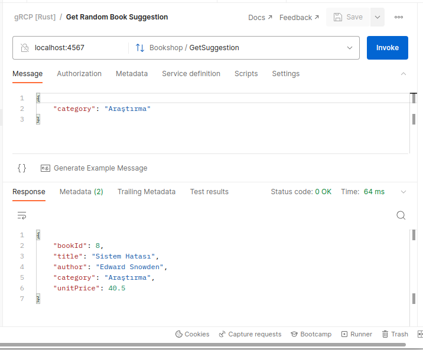

# BookShop gRPC Service

Rust ile ilgili küfeleri _(crate)_ kullanarak basit bir gRPC servisi nasıl yazılır öğrenmeye çalışıyorum. Bu örnekte 
- gRPC servis çalışma zamanı için tonic,
- asenkron çalışma zamanı için tokio,
- proto dosyasından gerekli rust kodlarını üretme için tonic-build
- protocol buffer desteği sağlaması için de prost 
- Postman gibi istemcilerde server reflection'dan yararlanabilmek için tonic-reflection

isimli crate'ler kullanılmakta.

```bash
# küfeleri eklemek için
cargo add tonic tonic-reflection prost 
cargo add tokio -F "macros","rt-multi-thread"
cargo add --build tonic-build

# sembolik bir veritabanı olarak 18 kitaptan oluşan bir JSON dosyamız var
# json ve rastgele kitap bulmak için gerekli küfeler de şöyle
cargo add serde_json rand
cargo add serde -F "derive"

# tonic-build sistemde protobuf derleyicisinin olmasını bekler
# ubuntu 22.04 için protobuf derleyicisini aşağıdaki şekilde kurdum
sudo apt install protobuf-compiler
# kurulum başarılı ise versiyon görülecektir
protoc --version

# proto klasörüne servis sözleşmesi eklendikten
# ve tonic-build işlemi için kök klasörde build.rs geliştirildikten sonra
# build komutu ile src altında bookshop.rs dosyasının oluştuğu gözlemlenmelidir
cargo build 
```

Örnek istemci talepleri için Postman kullanılabilir.

