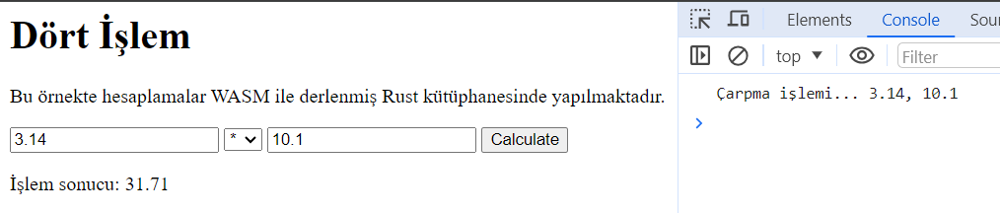

# Web Assembly Calculator

Rust ve Web Assembly kullanımının temellerini anlamak için oluşturulmuş basit bir girizgah örneğidir. HTML sayfasındaki kontrollerle etkileşim, hesaplamaların Rust kütüphanesinden yaptırılması gibi unsurları barındırır. Rust tarafındaki bağımlılıklar cdylib kütüphanesi ile wasm-bindgen isimli küfedir(crate). cdylib kütüphanesi Rust kodunun derlenmiş sonucunun, tarayıcıda veya WASM destekli diğer ortamlarda çalıştırılabilecek bir biçimde paketlenmesinde rol oynar.

## Web Assembly Derleme

Örnek proje kodu tamamlandıktan sonra wasm derlemesi gerçekleştirilir. Bu işlem rust kodlarından wasm derlemesinin yapılması, HTML tarafı için gerekli paketinin oluşturulması, javascript enstrümanlarına ait servisler ile iletişim kurmak için glue kod üretimi, optmiziasyon yönetimi gibi işler için gereklidir. Eğer sistemde yüklü değilse wasm-pack komut satırı aracının da kurulması gerekir.

```bash
# wasm pack kurulumu için
cargo install wasm-pack

# WASM derleme işlemi için
wasm-pack build --target web
```

Derleme işlemi başarılı olursa root altında pkg isimli bir klasör oluşacaktır.

## Sunucu Yayınlama

Sayfayı dilersek basit bir node sunucusu üzerinden yayınlayabliriz. Bunun için aşağıdaki komutlarla ilerlenebilir.

```bash
# root klasördeyken
touch server.js

npm init -y

# Express modülü host işlemlerimizi kolaylaştırır
npm install express

# Örneği çalıştırmak için, yine root klasördeyken
npm start
```

Projenin nihai halindeki iskelet yapısı aşağıdaki gibidir.

```text
calc/
├── pkg/
│   ├── calc_bg.wasm
│   ├── cacl.js
│   └── ...
├── src/
│   └── lib.rs
├── public/
│   ├── index.html
├── server.js
├── package.json
└── Cargo.toml
```

## Rust Tarafından Loglama

- Uygulamada rust tarafındaki fonksiyonlarda loglama yapılır. Ne var ki söz konusu kütüphane WASM derlmesine tabii tutulur ve aslında tarayıcı üzerinde çalışacak hale getirilir. Bu nedenle rust ortamına log bırakmak yerine tarayıcının console'una log bırakması beklenir. Tarayıcı tarafındaki console paketini kullanabilmek için web-sys küfesinden yararlanılır. Bu küfedeki log_1 ve log_2 gibi fonksiyonlar, tarayıcı konsolune log bırakabilir. Ne var ki bu durumda _cargo test_ ile test koşumu yapılamaz. Nitekim ilgili log_1 ve log_2 fonksiyonları wasm ortamına aittir. Bu nedenle basit bir mock stratejisi kullanılmaktadır. cfg niteliğinde target_arch ile, uygulandığı enstrümanın hangi çalışma zamanında kullanılacağı ifade edilir. Bu durumda _cargo test_ çağrısı yapıldığında tarayıcı konsolu ve wasm ortamı değil rust çalışma zamanının işletilmesi sağlanmış olur.

İşte çalışma zamanıan ait örnek bir çıktı...

