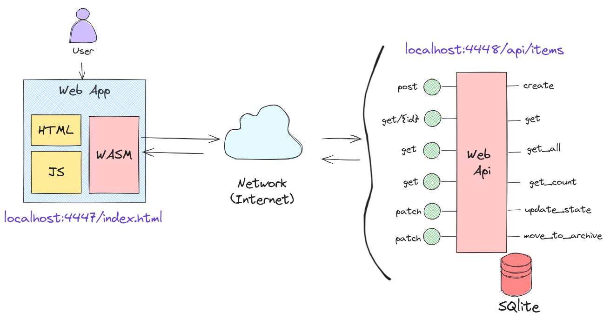
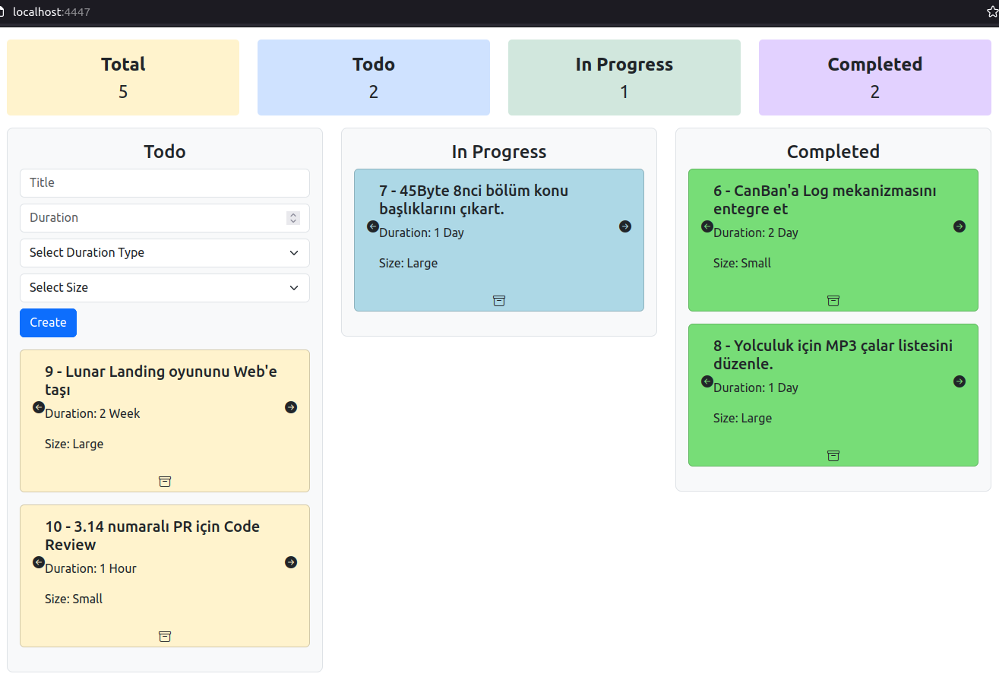
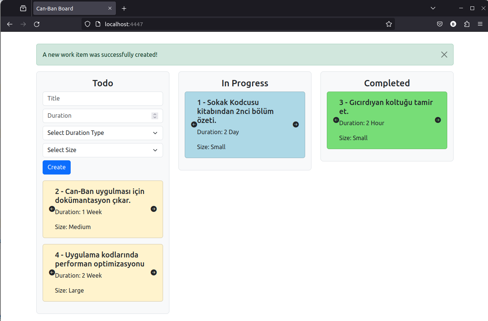
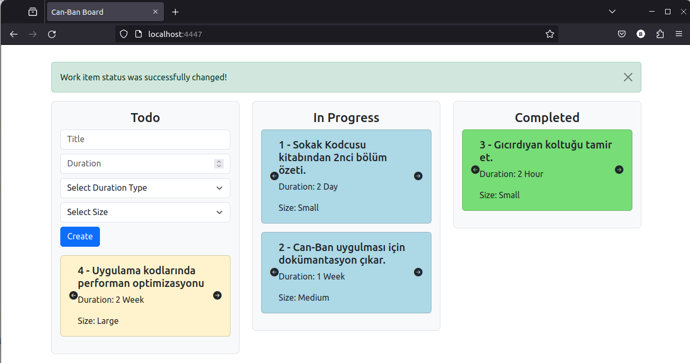

# Can-Ban Board

Bildiğimiz Kanban board'u Rust, Wasm ve HTML üçlemesinde geliştirmek istesem nasıl yaparım diye yola çıktığım örnektir. Solution içerisinde iki klasör yer alıyor. backend klasörü Rest tabanlı çalışan bir Web API için. Kanban board'daki varlıkların temel CRUD _(Create, Read, Update, Delete)_ operasyonları için kullanılıyor diyebiliriz. Frontend klasöründe önyüz uygulamamız yer alacak. Frontend taraftaki uygulamada basit HTML, Rust ve WASM üçlemesi söz konusu. UI ekranında yapılan işlemler için backend taraftaki servise gidildiğini ifade edebiliriz. Uygulamanın mimari modelini aşağıdaki şekille ifade edebiliriz.



## Update

Güncel olarak board'a en fazla 5 aktif görev eklenebiliyor. Dolayısıyla bazılarını tamamlamak ya da arşivlemek lazım. Arşivlemek içinse çöp kovasına basılması yeterli. Son değişikliklerle birlikte board'un güncel sayısal değerlerini gösteren bir raporda eklenmiş oldu.



Örneğin çalışma zamanı üç aşağı beş yukarı aşağıdaki ekran görüntülerinde olduğu gibidir.





## Frontend Tarafı

Bu projede wasm kullanılacağı için işleri kolaylaştıracak wasm-pack'e ihtiyacımız var.

```bash
# wasm pack kurulumu için
cargo install wasm-pack

# WASM paketini hazırlamak için
wasm-pack build --target web
```

## Backend Tarafı

Backend servisi tipik bir Rest servisi. Log çıktılarını görebilmek için aşağıdaki gibi hareket edebiliriz.

```bash
RUST_LOG=info cargo run
```

## Sunucu Yayınlama

Frontend taraftaki rust tabanlı wasm uygulamasını host etmek için node.js ve express kullanılabilir

```bash
# root klasördeyken
touch server.js

npm init -y

# Express modülü host işlemlerimizi kolaylaştırır
npm install express

# Frontend taraftaki örneği çalıştırmak için, yine root klasördeyken aşağıdaki komut kullanılabilir
npm start
```

## Çalışma Zamanı

Projeler can-ban isimli workspace altında birleştirilmiştir. Kolayca başlatmak için run.sh isimli terminal script'i kullanılabilir. 

```bash
# run.sh betiğini çalıştırılabilir hale getirmek için
sudo chmod +x run.sh

# Sonrasında çalıştırmak için
./run.sh
```

## HTTPS Desteği

Servis tarafına geliştirme safhasında SSL desteği sağlamak için bir openssl sertifikası kullanılabilir. Bunun için wi_api projesinde cert klasörü altında development amaçlı kullanılabilecek OpenSSL sertfikası üretilir. Key.pem dosyasında private key, cert.pem dosyasında da örnek sertifika yer alır.

```bash
# Self-Signed Encrypted Private Key oluşturmak için
sudo openssl req -x509 -newkey rsa:4096 -keyout key.pem -out cert.pem -sha256 -days 365

# Benim sistemde dosya izinleri yetersizdi. Bu yüzden şu komutları çalıştırdım.
sudo chmod 644 key.pem cert.pem
```

Örnek projedeki sertifikalar hem wi_api isimli backend servisinde hem de frontend tarafında ortaklaşa kullanılmaktadır. Buna istinaden servis ve node.js taraflarında da SSL kullanımı için gerekli kod değişiklikleri yapılmalıdır.

Bu adımlardan sonra curl, postman veya browser'lardan https ile ilgili servis komutlarına erişim sağlanabilir.
