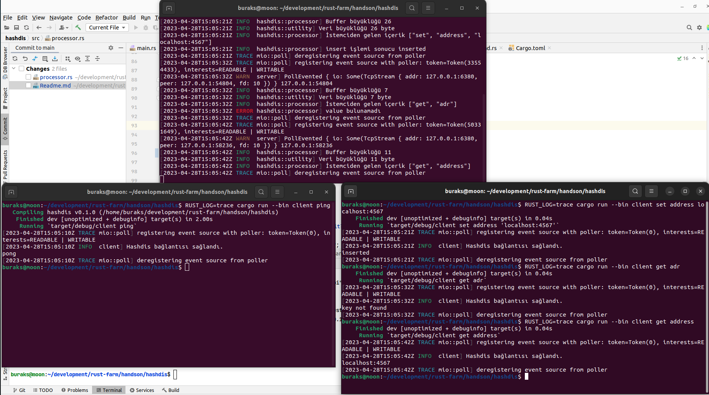

# Hashdis (Bir Redis Çakması :D )

Bilindiği üzere Redis, key-value deposu olarak bilinir ve dağıtık sistem karekteristiklerini taşır. Özellikle cache üstünde tutulan büyük çaplı veri setleri için idealdir. Tabii her dilde olduğu gibi Redis'i Rust ile yazmak istesek nasıl yazarız sorusu gün gelir programcının aklına düşer. This is the way!

## Crates

Uygulamada kullanılan paketler şöyle.

- Byte olarak gelen mesajları kolay yönetmek için bytes küfesi,
- log çıktıları için log ve env_logger küfeleri,
- asenkron çalışma ve Tcp tabanlı altyapıyı kurgulamak için tokio,
- komut satırı argümanlarını istemci tarafında kolayca ayrıştırmak için clap küfesi

```toml
[dependencies]
bytes = "1.4.0"
clap = { version = "4.2.4", features = ["derive"] }
env_logger = "0.10.0"
log = "0.4.17"
tokio = { version = "1.28.0", features = ["full"] }
```

## Çalışma Zamanı

Sunucu sürekli dinlemede olup istemciler mesaj gönderip alabilirler. Bu nedenle önce sunucu sonrasında istemciler çalıştırılarak denemeler yapılabilir.

```bash
# Sunucu tarafını çalıştırmak için
cargo run --bin server

# istemci de benzer şekilde çalıştırılabilir

# ping göndermek için
cargo run --bin client ping

# set key value için
cargo run --bin client set port localhost:4141/api

# get key için
cargo run --bin client get port
```

Uygulamanın çalışma zamanına ait örnek bir çıktısı aşağıdaki gibidir.



## Notlar

- **28 Nisan 2023:** Şu anki kodda ara ara istemciden gönderilen veri sunucu tarafına eksik ulaşıyor. Bu sunucunun çökmesine de sebebiyet vermekte. Sebebinin bulmaya çalışıyorum.