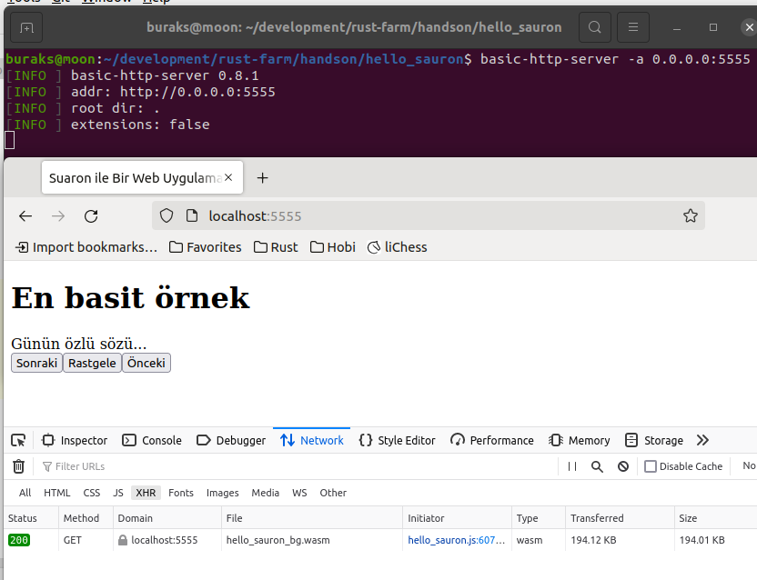
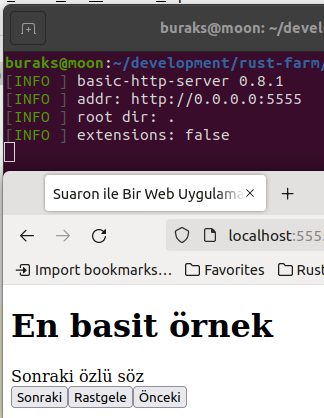
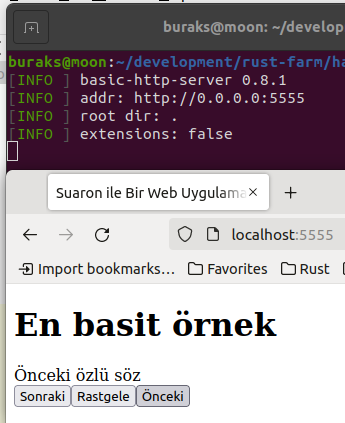
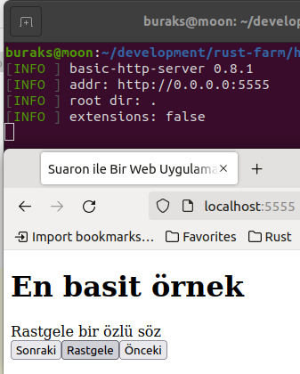
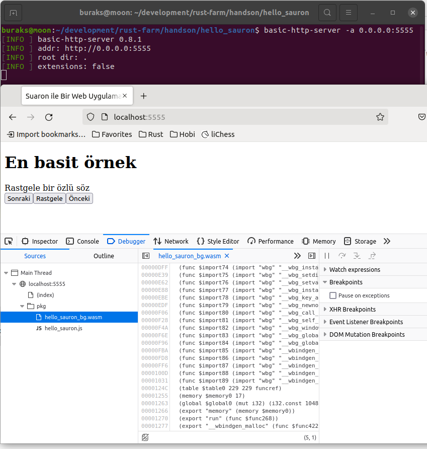

# Sauron ile Basit Bir Web Uygulaması Yazalım

Sauron, Web Assembly ile çalışır. Sistemde rust haricinde wasm-pack yüklü olmalı nitekim örnekte rust kodlarının wasm'a çevrilmesi söz konusu. Ayrıca statik dosyaların daha kolay sunulması için [basic-http-server](https://crates.io/crates/basic-http-server) küfesi kullanılıyor.

```shell
# wasm-pack için gerekli bazı binary'ler için
sudo apt install build-essential libssl-dev pkg-config ca-certificates

# wasm-pack kurulumu 
cargo install wasm-pack

# basic-http-server kurulumu
cargo install basic-http-server

# projenin oluşturulması
cargo new --lib hello_sauron

# kodlar tamamlandıktan sonra
# toml tarafında 
#
# [lib]
# crate-type = ["cdylib"]
#
# kısmını eklemeyi unutmayalım
wasm-pack build --release --target=web

# wasm olarak yazılan web uygulamasının bir html sayfasına
# link şeklinde bağlanması gerekir.
# src ile aynı seviyede bir index.html hazırlanır
touch index.html

# Sayfayı wasm ile bağladıktan sonra sunucuyu başlatabiliriz
basic-http-server -a 0.0.0.0:5555
```

Çalışma zamanından birkaç görüntü.

İlk açılış



Sonraki düğmesine basınca



Önceki düğmesine basınca



Rastgele düğmesine basınca



Javascript ile birlikte WASM içeriğinin yüklendiğini de görebiliriz.


