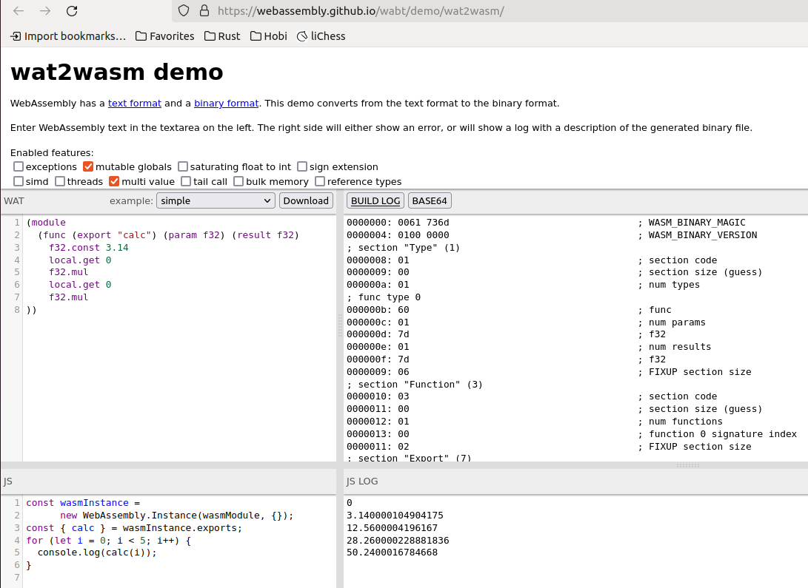
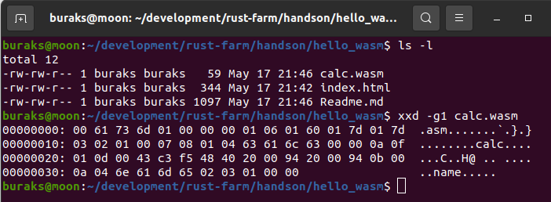
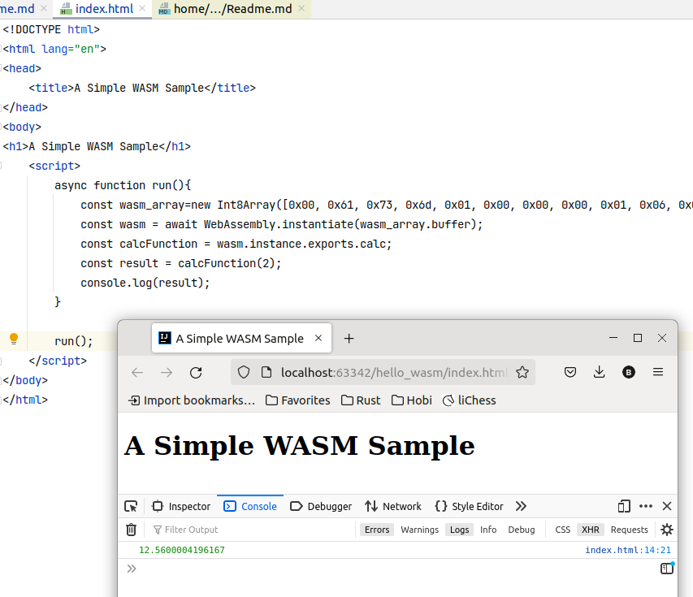

# HTML İçinden WASM Komutlarını İşletmek

İlk olarak [https://webassembly.github.io/wabt/demo/wat2wasm/](https://webassembly.github.io/wabt/demo/wat2wasm/) adresine gidilir ve örneklerden esinlenilerek basit bir *WAT(Web Assembly Text)* kodu oluşturulur. Örneğin,

```wasm
(module
  (func (export "calc") (param f32) (result f32)
    f32.const 3.14    
    local.get 0    
    f32.mul
    local.get 0
    f32.mul
))
```

gibi. Burada calc isimli bir fonksiyon tanımlanmıştır. 32 bit float tam sayı alıp yine aynı türde sonuç döndürür. İlk satırında 3.14 pi değeri sabit olarak tanımlanmış ardından get 0 ile fonksiyon parametresi çekilmiş sonrasında mul çağrısı ile de çarpma işlemi gerçekleştirilmiştir. Ardından fonksiyon parametresi tekrar hesaba katılmış ve pi * r * r işlemi gerçekleştirilmiştir.

Örnek kod parçasının doğru olup olmadığı ve çalışma zamanı sonuçları üstte belirttiğimiz siteden kontrol edilebilir.



Bu işlem sonrasında WASM dosyası indirilir. Dosyanın binary içeriği ve doğal olarak instruction bilgileri xxd aracı ile görülebilir.

```shell
xxd -g1 calc.wasm
```



Buradaki byte bilgilerinden yararlanılarak HTML tarafı için gerekli olan byte array oluşturulur.

```text
[0x00, 0x61, 0x73, 0x6d, 0x01, 0x00, 0x00, 0x00, 0x01, 0x06, 0x01, 0x60, 0x01, 0x7d, 0x01, 0x7d, 0x03, 0x02, 0x01, 0x00, 0x07, 0x08, 0x01, 0x04, 0x63, 0x61, 0x6c, 0x63, 0x00, 0x00, 0x0a, 0x0f, 0x01, 0x0d, 0x00, 0x43, 0xc3, 0xf5, 0x48, 0x40, 0x20, 0x00, 0x94, 0x20, 0x00, 0x94, 0x0b, 0x00, 0x0a, 0x04, 0x6e, 0x61, 0x6d, 0x65, 0x02, 0x03, 0x01, 0x00, 0x00]  
```

Bu işlemleri takiben HTML içeriği aşağıdaki gibi düzenlenebilir.

```html
<!DOCTYPE html>
<html lang="en">
<head>
    <title>A Simple WASM Sample</title>
</head>
<body>
<h1>A Simple WASM Sample</h1>
    <script>
        async function run(){
            const wasm_array=new Int8Array([0x00, 0x61, 0x73, 0x6d, 0x01, 0x00, 0x00, 0x00, 0x01, 0x06, 0x01, 0x60, 0x01, 0x7d, 0x01, 0x7d, 0x03, 0x02, 0x01, 0x00, 0x07, 0x08, 0x01, 0x04, 0x63, 0x61, 0x6c, 0x63, 0x00, 0x00, 0x0a, 0x0f, 0x01, 0x0d, 0x00, 0x43, 0xc3, 0xf5, 0x48, 0x40, 0x20, 0x00, 0x94, 0x20, 0x00, 0x94, 0x0b, 0x00, 0x0a, 0x04, 0x6e, 0x61, 0x6d, 0x65, 0x02, 0x03, 0x01, 0x00, 0x00]);
            const wasm = await WebAssembly.instantiate(wasm_array.buffer);
            const calcFunction = wasm.instance.exports.calc;
            const result = calcFunction(2);
            console.log(result);
        }

        run();
    </script>
</body>
</html>
```

Script bloğunda dikkat edileceği üzere byte array olarak wasm dosya içeriği kullanılmaktadır. WASM'ı başlatmak için WebAssembly'ın ilgili fonksiyonu kullanılır. Ardından dışaryı açılmış olan calc fonksiyonu deneysel olarak kullanılır. Sonuç console ekranına basılmıştır.

