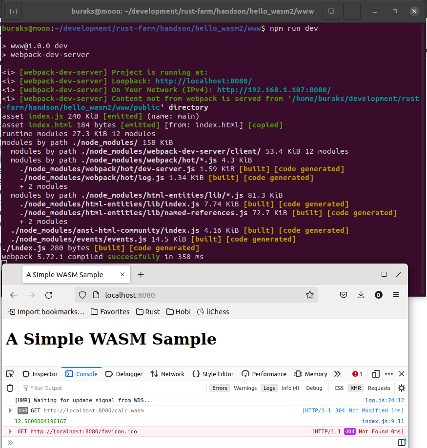
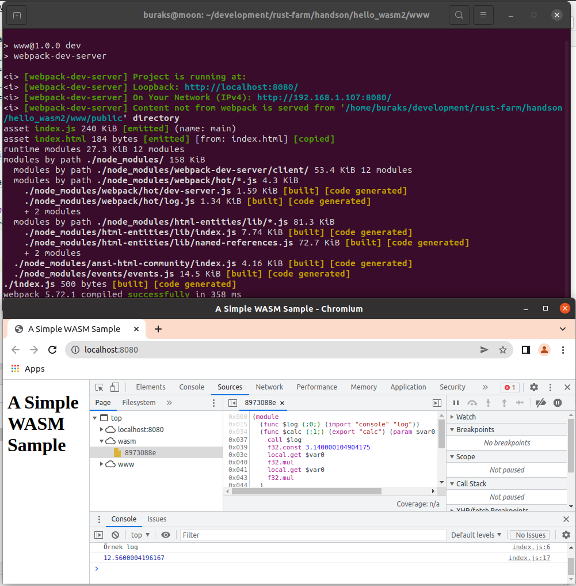

# WASM Çıktısını Web Sunucusu ile Birlikte Çalıştırmak

**hello_wasm** isimli çalışmada index.html içerisinde wasm binary'sini çalıştırmıştık. Ama index.html'i fiziki lokasyonundan işletmiştik. Pek tabii normalde bu sayfaların bir web sunucusu üzerinde olması ve işletilmesi gerekiyor. Bu örnekte nodejs ve webpack araçlarını kullanarak ilerleyeceğiz.

```shell
# İlk hazırlıklar
# Sistemde nodejs ve npm'in yüklü olduğunu varsayıyoruz

# Projenin oluşturulması
cargo new --lib hello_wasm2
cd hello_wasm2
mkdir www

# hello_wasm örneğinde kullandığımız calc.wasm dosyası ve index.html www altına taşınır

# www klöasrüne geçilir
cd www

# package.json oluşturulur
npm init -y

# sunucu tarafı ve dağıtım işleri için webpack'ten yararlanacağız
npm install --save webpack webpack-cli
npm install --save-dev webpack webpack-dev-server
npm install --save copy-webpack-plugin

# www klasörüne bir .gitignore dosyası eklenir.
# node_modules klasörü github tarafına gitmesin diye düzenlenir

# www klasöründe index.js dosyası oluşturulur
# hello_wasm örneğindeki script kodu buraya alınır
# index.html içeriğindeki script çağrısıda index.js'i kullanacak şekilde düzenlenmelidir.
touch index.js

# www altına public isimli genel olarak asset'lerin konulacağı public klasörü açılır
mkdir public

# www klasöründe webpack.config.js dosyası oluşturulur ve içeriği doldurulur
touch webpack.config.js
```

Bu işlemlerden sonra package.json dosyasına aşağıdaki komut eklenir.

```text
"dev": "webpack-dev-server"
```

Dolayısıyla *npm run dev* komutu ile artık webpack-dev-server işletilecek bu da development server'ın ayağa kaldırılmasını sağlayacaktır. webpack.config.js içerisindeki talimatlara görede index.js ve index.html dosyaları www/public klasörü içerisinde dağıtılır. Bu klasörde wasm dosyası da yer almaktadır.

```shell
# Sunucuyu başlatmak için şu komut kullanılır.
npm run dev
```

Bu işlemin ardından http://localhost:8080/ adresine gidilirse console tarafına fonksiyon sonucunun yansıdığı görülebilir.



## Javascript Nesnesini Import Etmek

Bir javascript nesnesini WASM tarafına import ederek kullandırabiliriz. Bunun denemek için index.js dosyasına aşağıdaki örnek kod parçası eklenir.

```javascript
async function run() {
    // Aşağıdaki nesne WASM tarafında kullanılabilir
    const logObject = {
        console: {
            log: ()=> {
                console.log("Örnek log");
            }
        }
    }

    const response = await fetch("calc.wasm");
    const buffer = await response.arrayBuffer();
    const wasm = await WebAssembly.instantiate(buffer,logObject);

    const calcFunc = wasm.instance.exports.calc;
    const result = calcFunc(2);
    console.log(result);
}

run();
```

Buna istinaden Web Assembly kodunu değiştirmemiz gerekiyor.

```text
(module
  (import "console" "log" (func $log))
  (func (export "calc") (param f32) (result f32)
    call $log
    f32.const 3.14    
    local.get 0    
    f32.mul
    local.get 0
    f32.mul
))
```

Tabii WASM'ın yeniden oluşturulması gerekmekte. Bunun için [https://webassembly.github.io/wabt/demo/wat2wasm/](https://webassembly.github.io/wabt/demo/wat2wasm/) adresine gidip oluşturulan dosyayı indirmemiz lazım. İndirilen içeriği yine public klasörü altına alıyoruz.

Sonrasına yine development server'ı çalıştırıp sonuçları değerlendirebiliriz.

```shell
npm run dev
```

