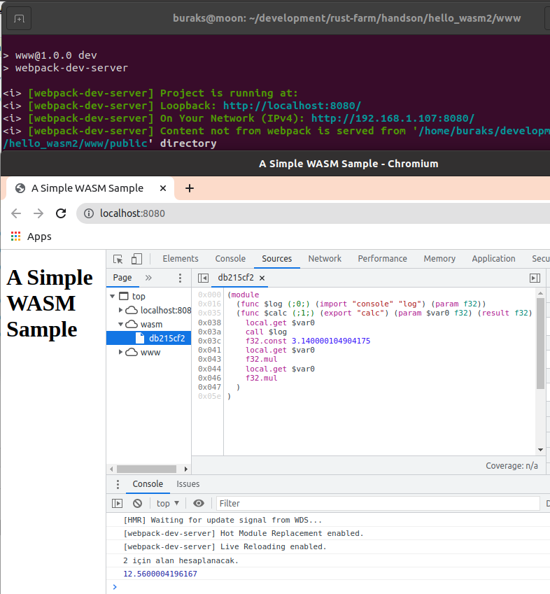
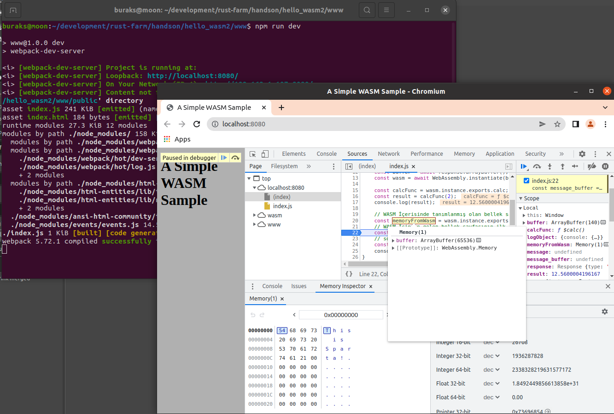
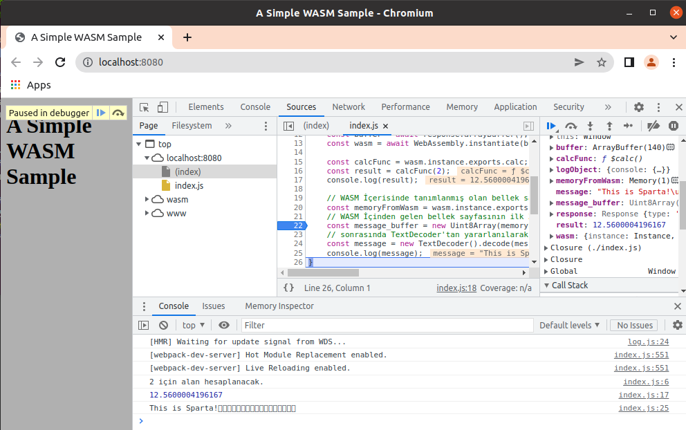
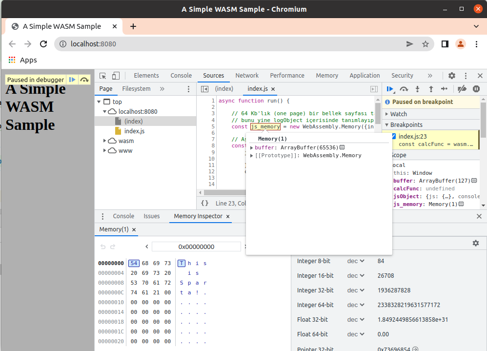

# WASM Çıktısını Web Sunucusu ile Birlikte Çalıştırmak

**hello_wasm** isimli çalışmada index.html içerisinde wasm binary'sini çalıştırmıştık. Ama index.html'i fiziki lokasyonundan işletmiştik. Pek tabii normalde bu sayfaların bir web sunucusu üzerinde olması ve işletilmesi gerekiyor. Bu örnekte nodejs ve webpack araçlarını kullanarak ilerleyeceğiz.

```shell
# İlk hazırlıklar
# Sistemde nodejs ve npm'in yüklü olduğunu varsayıyoruz

# Projenin oluşturulması
cargo new --lib hello_wasm2
cd hello_wasm2
mkdir www

# hello_wasm örneğinde kullandığımız calc.wasm dosyası ve index.html www altına taşınır

# www klöasrüne geçilir
cd www

# package.json oluşturulur
npm init -y

# sunucu tarafı ve dağıtım işleri için webpack'ten yararlanacağız
npm install --save webpack webpack-cli
npm install --save-dev webpack webpack-dev-server
npm install --save copy-webpack-plugin

# www klasörüne bir .gitignore dosyası eklenir.
# node_modules klasörü github tarafına gitmesin diye düzenlenir

# www klasöründe index.js dosyası oluşturulur
# hello_wasm örneğindeki script kodu buraya alınır
# index.html içeriğindeki script çağrısıda index.js'i kullanacak şekilde düzenlenmelidir.
touch index.js

# www altına public isimli genel olarak asset'lerin konulacağı public klasörü açılır
mkdir public

# www klasöründe webpack.config.js dosyası oluşturulur ve içeriği doldurulur
touch webpack.config.js
```

Bu işlemlerden sonra package.json dosyasına aşağıdaki komut eklenir.

```text
"dev": "webpack-dev-server"
```

Dolayısıyla *npm run dev* komutu ile artık webpack-dev-server işletilecek bu da development server'ın ayağa kaldırılmasını sağlayacaktır. webpack.config.js içerisindeki talimatlara görede index.js ve index.html dosyaları www/public klasörü içerisinde dağıtılır. Bu klasörde wasm dosyası da yer almaktadır.

```shell
# Sunucuyu başlatmak için şu komut kullanılır.
npm run dev
```

Bu işlemin ardından http://localhost:8080/ adresine gidilirse console tarafına fonksiyon sonucunun yansıdığı görülebilir.


## Javascript Nesnesini Import Etmek

Bir javascript nesnesini WASM tarafına import ederek kullandırabiliriz. Bunun denemek için index.js dosyasına aşağıdaki örnek kod parçası eklenir.

```javascript
async function run() {
    // Aşağıdaki nesne WASM tarafında kullanılabilir
    const logObject = {
        console: {
            log: ()=> {
                console.log("Örnek log");
            }
        }
    }

    const response = await fetch("calc.wasm");
    const buffer = await response.arrayBuffer();
    const wasm = await WebAssembly.instantiate(buffer,logObject);

    const calcFunc = wasm.instance.exports.calc;
    const result = calcFunc(2);
    console.log(result);
}

run();
```

Buna istinaden Web Assembly kodunu değiştirmemiz gerekiyor.

```text
(module
  (import "console" "log" (func $log))
  (func (export "calc") (param f32) (result f32)
    call $log
    f32.const 3.14    
    local.get 0    
    f32.mul
    local.get 0
    f32.mul
))
```

Tabii WASM'ın yeniden oluşturulması gerekmekte. Bunun için [https://webassembly.github.io/wabt/demo/wat2wasm/](https://webassembly.github.io/wabt/demo/wat2wasm/) adresine gidip oluşturulan dosyayı indirmemiz lazım. İndirilen içeriği yine public klasörü altına alıyoruz.

Sonrasına yine development server'ı çalıştırıp sonuçları değerlendirebiliriz.

```shell
npm run dev
```


Hatta istersek import edilen nesne fonksiyonlarına parametre de verebiliriz. Örneğin loglama işini yapan fonksiyona yarıçap bilgisini atamak istediğimizi düşünelim.

```text
(module
  (import "console" "log" (func $log(param f32)))
  (func (export "calc") (param f32) (result f32)
    local.get 0
    call $log
    f32.const 3.14    
    local.get 0    
    f32.mul
    local.get 0
    f32.mul
))
```

ve index.js içeriğimiz

```javascript
async function run() {
    // Aşağıdaki nesne WASM tarafında kullanılabilir
    const logObject = {
        console: {
            log: (param)=> {
                console.log(param+" için alan hesaplanacak.");
            }
        }
    }

    const response = await fetch("calc.wasm");
    const buffer = await response.arrayBuffer();
    const wasm = await WebAssembly.instantiate(buffer,logObject);

    const calcFunc = wasm.instance.exports.calc;
    const result = calcFunc(2);
    console.log(result);
}

run();
```

Sonuç,



## Bellek(Memory) ile Çalışma

Web Assembly modülü içerisinde bellek ile doğrudan çalışma şansımız var. Burada bir bellek bölgesi tanımlatıp JS tarafına açabiliriz. Benzer şekilde tam tersi durum da söz konusudur. Yani JS tarafında bir bellek tanımı oluşturup Web Assembly tarafına açabiliriz. Bu WebAssembly ile Javascript arasında veri paylaşmanın yollarından birisidir.

Web assembly tarafın için aşağıdaki modülü kullanabiliriz.

```text
(module
  (import "console" "log" (func $log(param f32)))
  (memory $mempage 1)
  (data (i32.const 0) "This is Sparta!")
  (func (export "calc") (param f32) (result f32)
    local.get 0
    call $log
    f32.const 3.14    
    local.get 0    
    f32.mul
    local.get 0
    f32.mul
  )
  (export "mem" (memory $mempage))
)
```

(memory $mempage 1) kısmında tek bir bellek sayfası *(Memory Page)* tanımlıyoruz. Bu 64 Kb büyüklüğünde bir bellek sayfası anlamına gelmektedir. Bu bellek sayfasına kullanımı kolaylaştıran $mempage takma ismini *(alias)* verdik. İzleyen satırda da bellek sayfasının sıfırıncı konumundan başlamak suretiyle string bir veriyi bellek sayfasına aldık. Ayrıca export kısmı ile söz konusu bellek sayfasını dışarıdan kullanılabilmesi için de açıyoruz. 
Tabii yine [https://webassembly.github.io/wabt/demo/wat2wasm/](https://webassembly.github.io/wabt/demo/wat2wasm/) adresine gidip bu WAT'a karşılık gelen binary dosyasını ürettirip indirmemiz lazım.

Yeni WASM binary'si ile gelen bellek sayfasını index.js tarafında da aşağıdaki gibi ele alabiliriz.

```javascript
async function run() {
    // Aşağıdaki nesne WASM tarafında kullanılabilir
    const logObject = {
        console: {
            log: (param)=> {
                console.log(param+" için alan hesaplanacak.");
            }
        }
    }

    const response = await fetch("calc.wasm");
    const buffer = await response.arrayBuffer();
    const wasm = await WebAssembly.instantiate(buffer,logObject);

    const calcFunc = wasm.instance.exports.calc;
    const result = calcFunc(2);
    console.log(result);

    // WASM İçerisinde tanımlanmış olan bellek sayfasına erişim sağlanıyor
    const memoryFromWasm = wasm.instance.exports.mem;
    // WASM İçinden gelen bellek sayfasının ilk 32 byte'ını okumak için bir array tanımlanır
    const message_buffer = new Uint8Array(memoryFromWasm.buffer,0,32);
    // sonrasında TextDecoder'tan yararlanılarak byte dizisi decode edilir(okunur hale getirilir)
    const message = new TextDecoder().decode(message_buffer);
    console.log(message);
}
```

Bu işlemlerin ardından uygulama çalıştırılıp console'a düşen log'lara bakılabilir ve hatta bellek sayfası da analiz edilebilir.

```shell
# www klasöründeyken
npm run dev
```





Üstteki örnek WASM tarafındaki bir bellek sayfasının Javascript tarafında okunması ile ilgili bir senaryoyu işletmekte. Tam tersi durum da söz konusudur. Bunun için index.js dosyasında aşağıdaki değişiklikler yapılır.

```javascript
async function run() {

    // 64 Kb'lık (one page) bir bellek sayfası tanımlanır
    // bunu yine logObject içerisinde tanımlayıp WASM tarafında ele alınmasını sağlayabiliriz.
    const js_memory = new WebAssembly.Memory({initial:1});

    // Aşağıdaki nesne WASM tarafında kullanılabilir
    const jsObject = {
        js: {
            mem : js_memory
        },
        console: {
            log: (param)=> {
                console.log(param+" için alan hesaplanacak.");
            }
        }
    }

    const response = await fetch("calc.wasm");
    const buffer = await response.arrayBuffer();
    const wasm = await WebAssembly.instantiate(buffer,jsObject);

    const calcFunc = wasm.instance.exports.calc;
    const result = calcFunc(2);
    console.log(result);

    // JS tarafında tanımlı bellek bölgesini yukarıda tanımlamıştık
    const message_buffer = new Uint8Array(js_memory.buffer,0,32);
    const message = new TextDecoder().decode(message_buffer);
    console.log(message);
}
```

jsObject içerisinde js niteliği üzerinden taşınan mem isimli değişken, 64 Kb boyutundaki bellek sayfasını işaret eder. Bu alan WASM tarafından da kullanılabilir. Bunun için WAT tarafının aşağıdaki gibi değiştirilmesi yeterlidir.

```text
(module
  (import "console" "log" (func $log(param f32)))
  (memory (import "js" "mem") 1)
  (data (i32.const 0) "This is Sparta!")
  (func (export "calc") (param f32) (result f32)
    local.get 0
    call $log
    f32.const 3.14    
    local.get 0    
    f32.mul
    local.get 0
    f32.mul
  )
)
```

Tabii bir önceki örnekte kullanılan $mempage burada yer almıyor. Sonrasında yine [https://webassembly.github.io/wabt/demo/wat2wasm/](https://webassembly.github.io/wabt/demo/wat2wasm/) adresine gidip wasm dosyasını indirip www/public klasöründeki calc.wasm ile değiştirmeliyiz. 

Sonrasında

```shell
npm run dev
```




