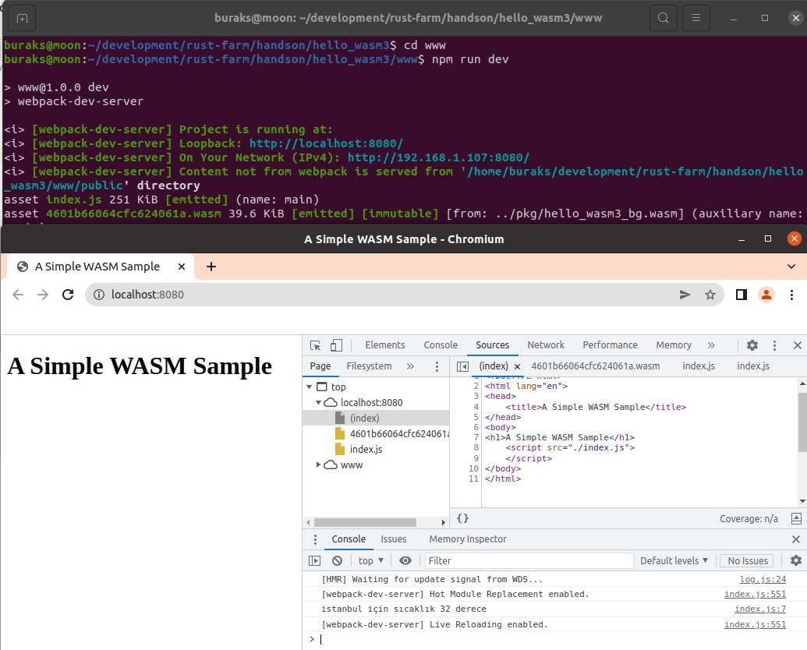

# WASM Çalışmaya Devam (Rust işin içerisine giriyor)

**hello_wasm2** isimli çalışmanın devamı niteliğindedir. hello_wasm ve hello_wasm2 isimli örneklerde daha çok WASM'ın JS tarafı ile konuşması veya üretilmesi üzerine değindik. Kod karmaşıklığını azaltmak için hello_wasm2'nin bir klonu üstünden ilerleyeceğiz. WASM binary'sini manuel üretmek yerine Rust kodlarından WASM üretilmesini işleyeceğiz.

İlk olarak cargo.toml dosyasında aşağıdaki değişiklikler yapılır.

```toml
[dependencies]
wasm-bindgen = "0.2.80"
rand = "0.8.5"

# shared library olacağını ifade ettik
[lib]
crate-type = ["cdylib"]
```

Sonrasında lib.rs dosyasına basit bir fonksiyon eklenir. Aşağıdaki gibi...

```rust
use rand::Rng;
use wasm_bindgen::prelude::*;

#[wasm_bindgen]
pub fn print_temperature(city: &str) -> String {
    let mut rng = rand::thread_rng();
    let temperature = rng.gen_range(-10..50);
    format!("{} için sıcaklık {} derece", city, temperature)
}
```

Sonrasında terminale geçilir ve aşağıdaki adımlar takip edilir.

```shell
# kodun derlenebildiğinden bir emin olalım
cargo build

# Rust kodlarını wasm olarak paketlememizi kolaylaştıracak yardımcı araç eklenir (Sistemde yoksa)
cargo install wasm-pack

# build işlemi gerçekleştirilir.
# bu işlem sonrasında pkg isimli bir klasör oluşacak ve içerisine wasm ile js dosyaları eklenecektir.
wasm-pack build --target web
```

Bu işlemler başarılı şekilde tamamlandıysa pkg klösörünün oluşmuş olması gerekir. Bu klasördeki hello_wasm.js incelenmelidir.

Şimdi www klasörüne odaklanalım. Eski örnek, public klasöründeki calc.wasm'ı kullanıyor. Oysa ki pkg klasöründeki paketin kullanılması lazım. Bu nedenle pkg klasöründeki package.json'da yer alan modül adı www altındaki package.json'da yer alan dependencies kısmında bildirilmelidir. Aşağıdaki gibi,

```text
  "dependencies": {
    "copy-webpack-plugin": "^11.0.0",
    "webpack-cli": "^4.9.2",
    "hello_wasm3": "file:../pkg"
  },
```

Ardından bu bildirimin yeniden bağlanması için www klasörü altındayken aşağıdaki komut çalıştırılır.

```shell
# www klasöründeyken
npm install
```

Paketin eklenip eklenmediğini görmek için www altındaki node_modules klasörüne gidilir. Burada hello_wasm3 için bir klasör olmalıdır. Aslında pkg klasörü içerisindeki enstrümanların *(wasm, ts, js ...)* buraya alındığını görebiliriz.

Artık www altındaki index.js içeriği yeni paket ile gelen modülü kullanacak şekilde değiştirilebilir.

```javascript
import init, {print_temperature} from "hello_wasm3";

init().then(_ => {
    var info = print_temperature("istanbul");
    console.log(info);
})
```

JS tarafıda bu şekilde hazırlandıktan sonra www klasöründeyken web sunucusu başlatılabilir.

```shell
# www klasöründeyken
npm run dev
```



Sıradaki aşamada rust kodu içinden var olan bir JS fonksiyonunun çağırılması var. Örneğin javascript'in en bilinen fonksiyonlarından olan alert'i ele alalım. Bu fonksiyonu Rust kodu içinden çağırmak için lib.rs'te aşağıdaki değişiklikleri yapmak yeterli.

```rust
use rand::Rng;
use wasm_bindgen::prelude::*;

#[wasm_bindgen]
pub fn print_temperature(city: &str) -> String {
    let mut rng = rand::thread_rng();
    let temperature = rng.gen_range(-10..50);
    // alert esasında JS'in bir fonksiyonudur.
    // Dolayısıyla buradaki çağrı sonrası tarayıca alert mesajı işletilecektir.
    alert("Volaaa");
    format!("{} için sıcaklık {} derece", city, temperature)
}

// Dilersek aşağıdaki gibi Javascript tarafında var olan bir fonksiyonun
// rust tarafından çağırılması sağlayabiliriz.
#[wasm_bindgen]
extern "C" {
    pub fn alert(s: &str);
}
```

Tabii işlemlerden sonra yeni bir paket için build alınması gerekecektir. Sonrasında *npm run dev* ile ilerlenebilir.

Uygulamaya eklediğimiz bir diğer şeyde bootstrap işlevi. www klasörüne eklenen bootstrap aslında sunucu başladıktan sonra ilk devreye giren setup modülü gibi düşünülebilir. Bu örnek özelinde index.js modülünün yüklenmesi ve yüklenirken olası hataların log olarak bildirimi amacıyla kullanılmaktadır. bootstrap.js içeriği oldukça basittir.

```text
import("./index.js")
    .catch(e => console.error("Index modülün yüklenirken hata.",e))
```

Tabii buna göre webpack.config.js ve index.html tarafındaki index.js çağrıları da bootstrap.js ile değiştirilmelidir. Bu değişiklik sonrası webpack ile yeni bir paket için build almaya gerek yoktur. Doğrudan *npm run dev* ile ilerlenebilir. 

- wasm-bindgen hakkında: WebAssembly'ın kısıtlarından birisi DOM *(Document Object Model)* doğrudan erişememesidir. Bu nedenle WebAssembly içinden web sayfasındaki elementlere erişim Javascript fonksiyon çağrıları ile mümkün olabilir. Lakin bunun için de WebAssembly ile Javascript paylaşımlı bellek bölgesi kullanır ve WASM tarafında Javascript tarafına giden nesneler byte olarak gönderilir *(Marshalling)* Çok doğal olarak bu zahmetli bir iş. wasm-bindgen isimli crate bu noktada bir köprü vazifesi görür ve işleri kolaylaştırır.
- oluşan web assembly dosyasının boyutu beklediğimizden büyük olabilir. Bu noktada optimizasyon için [https://github.com/rustwasm/wee_alloc](https://github.com/rustwasm/wee_alloc) crate'inden yararlanılabilir.

