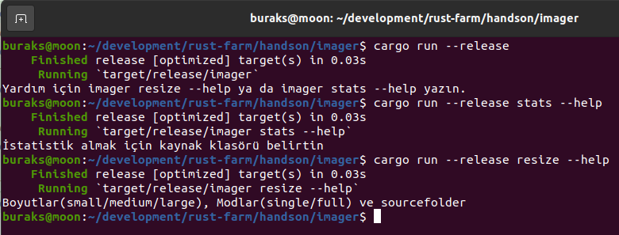
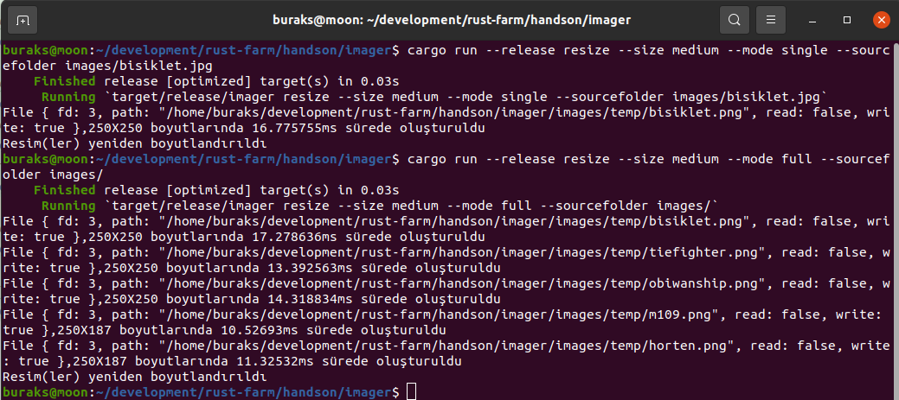

# Resim Boyutlandırıcı

Bu öğretide bir klasördeki tek veya n sayıdaki resmin farklı oranlarda yeniden boyutlandırılması işlemleri ele alınmakta. Program komut satırından çalıştırılabilecek şekilde tasarlanıyor. Komut satırından argüman toplamak, temel dizin işlemleri, resim boyutlandırmak için harici crate kullanımı ve işlem zamanının ölçümlenmesi gibi işlemler öğretiliyor.

```shell
cargo new --lib imager

# Çalıştırmadan önce bir build alıyoruz
cargo build --release

# Genel yardım için 
cargo run --release
# resize komut ile ilgili yardım için
cargo run --release resize --help
# stats komutu ile ilgili yardım için
cargo run --release stats --help

# tek bir resim dosyasını boyutlandırma işlemi
cargo run --release resize --size medium --mode single --sourcefolder images/bisiklet.jpg

# klasördeki tüm dosyaları boyutlandırma işlemi
cargo run --release resize --size medium --mode full --sourcefolder images/
```



