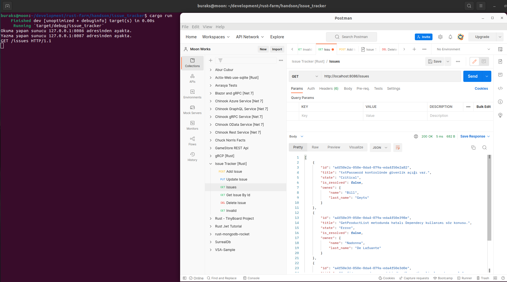
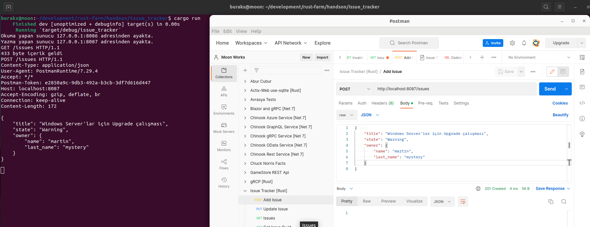

# Issue Tracker

Bir haftasonu pratiği :D Örnekte bir HTTP Web API geliştirmeye çalışıyorum. Kod iyileştirme çalıştırmaları ile ilgili issue açmak, kapatmak veya listelemek için kullanmayı planlıyorum. Amaçlarımdan birisi minimum seviyede harici küfe (crate) kullanmak.

## Çalışma Zamanı

Örneği çalıştırdıktan sonra Postman, curl gibi araçlarla örnek HTTP talepleri gönderilebilir.

```bash
cargo run

# Hello demek için
http://localhost:8086/hello

# Açık tüm talepleri görmek için
http://localhost:8086/issues
```

İlk etapta sistemde zaten var olan dummy issue verisini denedim. Normalde JSON serileştirme için serde crate'ten yararlanılabilir tabii ama amacım saf rust kodları kullanarak örneği tamamlayabilmek. Yani built-in gelen modül ve işlevsellikler dışına çıkmadan bunu yapabilmek istiyorum.



Issue ve Owner veri yapıları için ters serileştirme işlevselliklerini ekledikten sonra örnek bir POST talebi için aşağıdaki sonucu elde etmeyi başardım.

Örnek Post içeriği

```json
{
    "id": 10001,
    "title": "Windows Server'lar için Upgrade çalışması",
    "state": "Warning",
    "owner":{
        "name":"martin",
        "last_name":"mystery"
    }
}
```



## Yapmak İstediklerim

- [x] HTTP Post ile server tarafına Issue kaydı alabilmeliyim.
- [x] Issue için ters serileştirme işlevleri gerekiyor.
- [x] Server tarafı asenkron çalışacak hale getirilebilir.
- [ ] Get/{id}, Delete ve hatta Put işlevsellikleri eklenmeli.
- [ ] Issue'lar ilk etapta sıkıştırılmış bir dosya da saklanabilir _(DB kullanırsam DB ile konuşturma noktasında saf Rust işlevleri ile nasıl ilerleyeceğim. Bu önemli bir soru işaret :D )_

