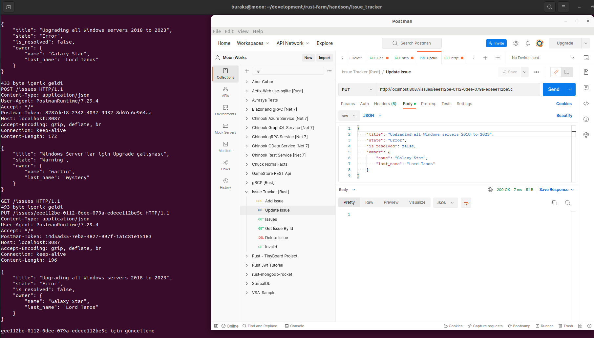

# Issue Tracker

Bir haftasonu pratiği :D Örnekte bir HTTP Web API geliştirmeye çalışıyorum. Kod iyileştirme çalıştırmaları ile ilgili issue açmak, kapatmak veya listelemek için kullanmayı planlıyorum. Amaçlarımdan birisi minimum seviyede harici küfe (crate) kullanmak.

## Çalışma Zamanı

Örneği çalıştırdıktan sonra Postman, curl gibi araçlarla örnek HTTP talepleri gönderilebilir.

```bash
cargo run

# Hello demek için
http://localhost:8086/hello

# Açık tüm talepleri görmek için
http://localhost:8086/issues
```

İlk etapta sistemde zaten var olan dummy issue verisini denedim. Normalde JSON serileştirme için serde crate'ten yararlanılabilir tabii ama amacım saf rust kodları kullanarak örneği tamamlayabilmek. Yani built-in gelen modül ve işlevsellikler dışına çıkmadan bunu yapabilmek istiyorum.


Issue ve Owner veri yapıları için ters serileştirme işlevselliklerini ekledikten sonra örnek bir POST talebi için aşağıdaki sonucu elde etmeyi başardım.

Örnek Post içeriği

```json
{
    "title": "Windows Server'lar için Upgrade çalışması",
    "state": "Warning",
    "owner":{
        "name":"martin",
        "last_name":"mystery"
    }
}
```


Belli bir issue'yu çeken GET operasyonu da aşağıdaki gibi çalışmakta.


Belli bir issue'yu silmek için DELETE operasyonu da aşağıdaki gibi çalışmakta.


Bir Issue'nun bilgilerini güncellemek için de PUT operasyonundan yararlanılabiliyor.



## Yapılacaklar

- [x] HTTP Post ile server tarafına Issue kaydı alınması.
- [x] Issue için ters serileştirme işlevleri.
- [x] Server tarafının asenkron çalıştırılması.
- [x] Handler kısmının talepleri okuma ve yazma noktasında ikiye ayrılması. 
- [x] Get/{id} işlevselliğinin kazandırılması.
- [x] Delete/{id} ve Put işlevsellikleri.
- [x] Issue verilerindeki Id değerinin GUID türüne dönüştürülmesi.
- [ ] Sisteme asenkron bir event kurgusunun eklenmesi ve aşağıdaki olayların takibi.
  - [ ] Yeni bir Issue eklendiğinde olay bilgisi yayınlanması.
  - [ ] Bir Issue state değişikliğine uğradığında olay bilgisi yayınlanması.
- [ ] Persistancy mod eklenmesi _(DB kullanılırsa DB ile konuşturma noktasında saf Rust işlevleri ile nasıl ilerlenebilir? İlk etapta dosyaya binary yazma düşünülebilir mi? )_

