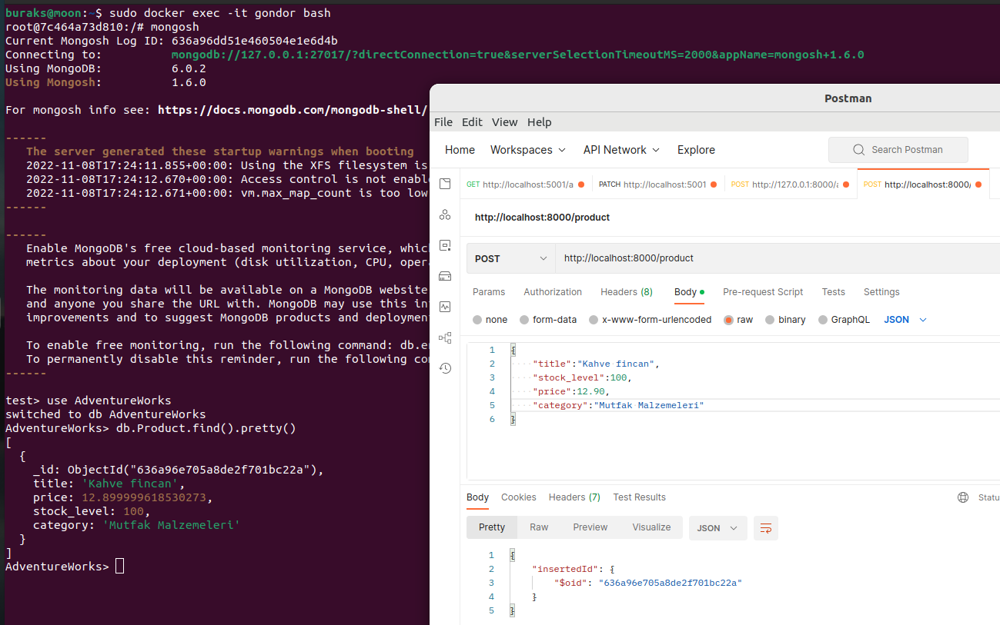
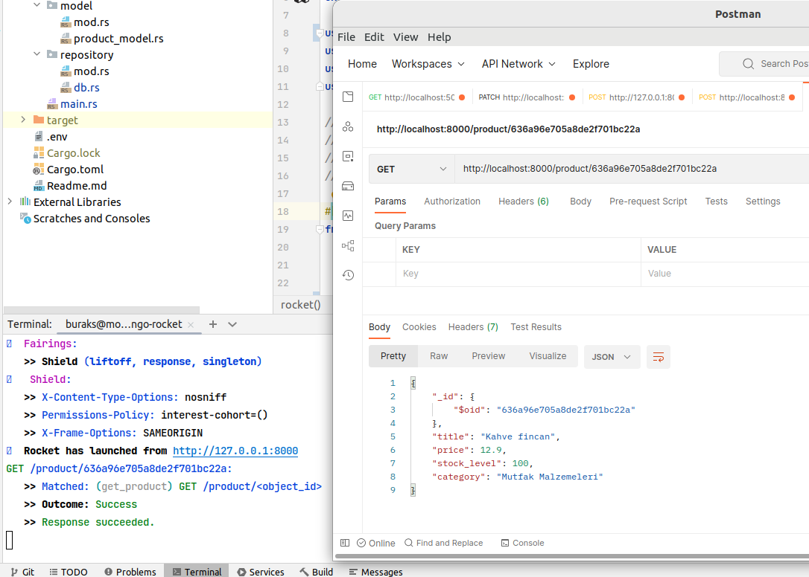
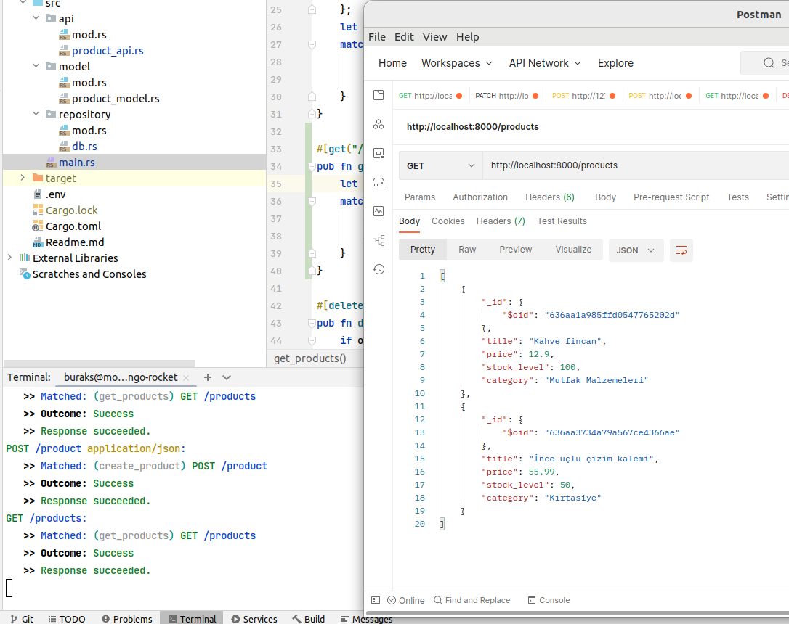
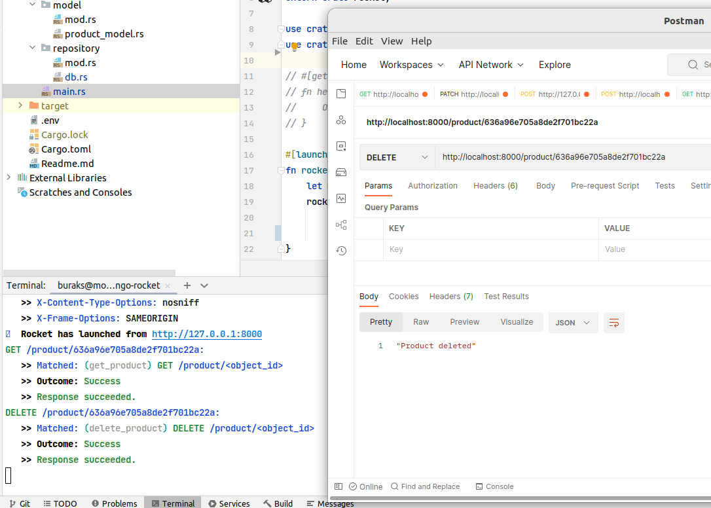
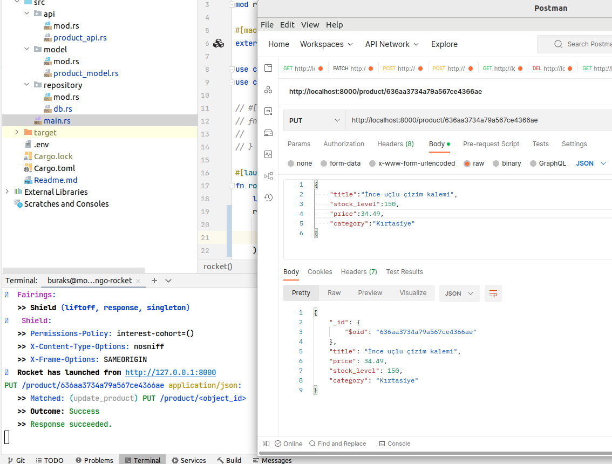

Bu örnekte MongoDb veritabanı kullanılıyor. Linux tabanlı sistemimde onu çalıştırmak için aşağıdaki terminal komutunu kullandım.

```shell
sudo docker run -d -p 27017-27019:27017-27019 --name gondor mongo
sudo docker container ps -a

# container shell'in geçmek için
sudo docker exec -it gondor bash

# mongodb komutlarını çalıştırmak içinse
mongosh
# veritabanlarını gösterir
show dbs
# bir veritabanı oluşturalım
use AdventureWorks
# Temsili bir kayıt eklemek için
db.category.insertOne({title:"Book"})
# eklenen içeriği görmek için
db.category.find().pretty()

#mongosh içinde ekranı temizlemek için
cls
# mongosh 'dan çıkmak için
exit
# container terminalinden çıkmak için
exit
```

Örnek bir veri ekleme işlemi için aşağıdaki JSON içeriği kullanılabilir.

```json
{
    "title":"Kahve fincan",
    "stock_level":100,
    "price":12.90,
    "category":"Mutfak Malzemeleri"
}
```

Bunu uygulamayı çalıştırdıktan sonra _(cargo run)_ http://localhost:8000/product adresinden deneyebiliriz. Ben Postman'den yararlandım.



Dikkat edileceği üzere eklenen ürün bilgisini görüntülemek için aşağıdaki mongosh komutu kullanılmıştır.

```text
db.Product.find().pretty()
```

Bir dokümanı aramak içinse HTTP Get çağrısı yapılabilir. Parametre ilgili ürünün object id bilgisidir.



Product koleksiyonundaki tüm verileri çekmek istersek bu durumda http://localhost:8000/products adresine bir HTTP Get çağrısı göndermek yeterlidir.



Silme işlemi için yine doküman id bilgisinden yararlanılır. Örnek bir HTTP Delete çağrısı http://localhost:8000/product/636a96e705a8de2f701bc22a gibidir. İşte postman görüntüsü.



Son olarak birde güncelleme işlemi deneyelim. Bu sefer HTTP Put ile örneğin http://localhost:8000/product/636aa3734a79a567ce4366ae şeklinde bir talep ile güncelleme yapılabilir. Tabii sizin örneklerinizde object_id değeri farklı olacaktır.

```json
{
    "title":"İnce uçlu çizim kalemi",
    "stock_level":150,
    "price":34.49,
    "category":"Kırtasiye"
}
```

