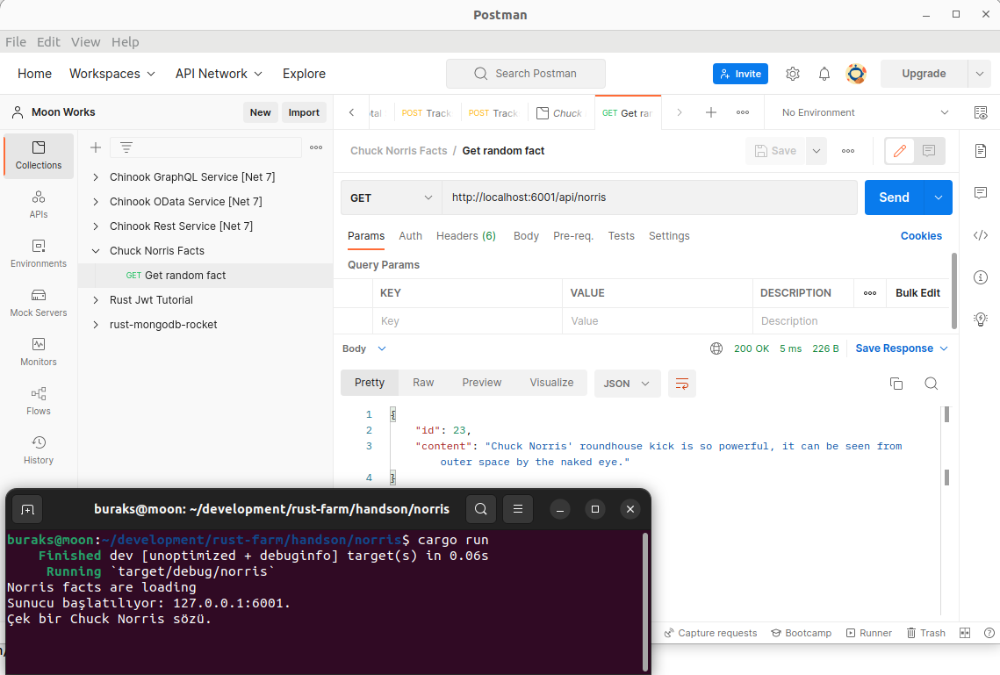

# Norris Gerçekleri

Bu örnekte aşağıdaki çağrım için rastgele Chuck Norris sözü dönen bir rest servis yer alıyor. Axum framework kullanılan örnekte, fikizi bir dosyadan 101 adet Chuck Norris söz yükleniyor. Elde edilen vector nesnesi bir State nesnesinde tutuluyor ve böylece tekrar tekrar yüklenmesinin önüne de geçiliyor. Ayrıca çıktılar JSON formatında geriye döndürülmekte.

```bash
curl get http://localhost:6001/api/norris
```

