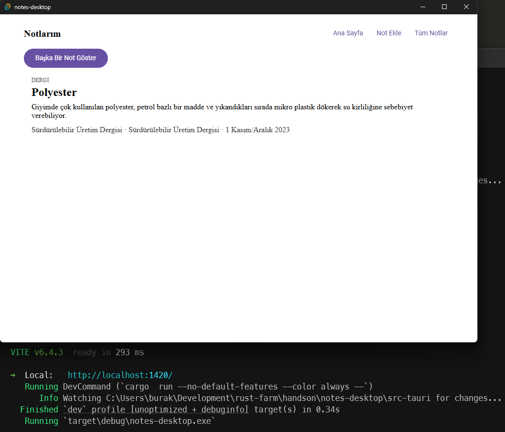
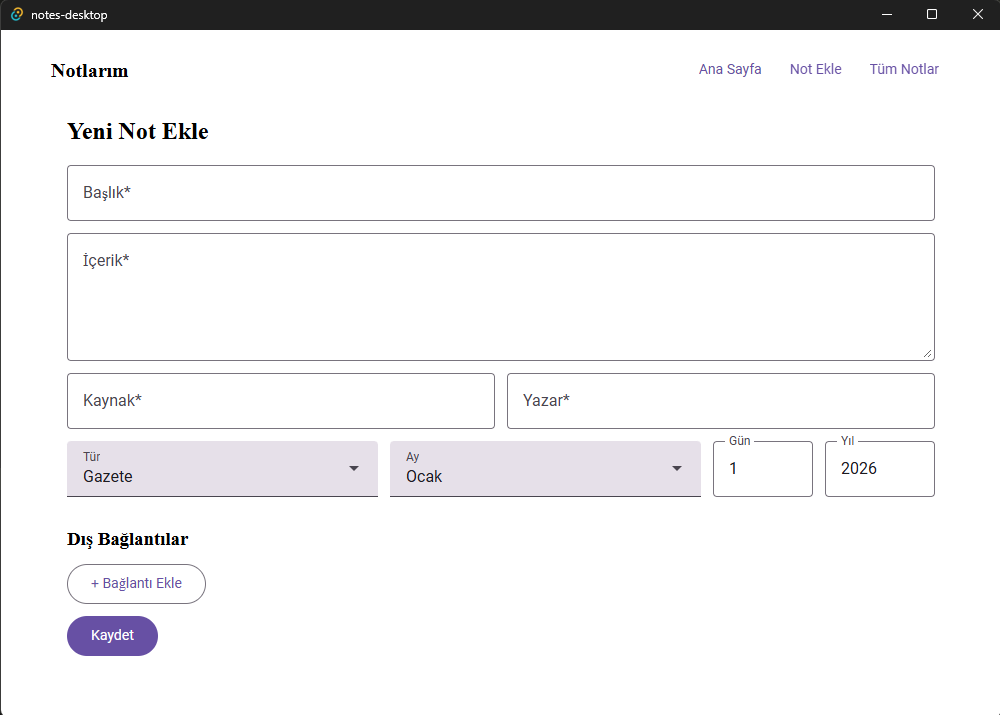

# Notes Desktop

> ÖNEMLİ NOT: Bu uygulama `Claude Sonnet` sürümüne daha önceden geliştirilmiş `notes-server` uygulaması referans verilerek yazdırılmıştır.

`Practices/notes-server` isimli warp tabanlı web uygulamasının Tauri ile yazılmış masaüstü portu. Aynı işi görür: rastgele bir not gösterir, yeni not eklemeye, tüm notları listeleyip sıralamaya ve arşivlemeye (soft-delete) izin verir. `handson/sys-trace` referans alınarak Vanilla + TypeScript + Vite iskeleti ve Material Design 3 arayüzü (`@material/web`) ile hazırlanmıştır.

Orijinal uygulamadan farkı: veriler artık `notes.json` yerine uygulamanın veri dizinindeki bir SQLite dosyasında (`notes.db`) tutulur. Tek kaynak SQLite'tır; tablo yoksa `db::init_db` şemayı oluşturur, notlar uygulama içinden eklenir.

> Örnekte veritabanını Windows sistemimde `C:\Users\burak\AppData\Roaming\com.buraks.notes-desktop\notes.db` konumuna attı. Linux tarafında `~/.config/com.buraks.notes-desktop/notes.db` olur.

## Kurulum

Windows'ta geliştirme için Node.js, Rust ve Visual Studio Build Tools (MSVC) yeterlidir.

Linux'ta geliştirme için (sys-trace'te olduğu gibi):

```bash
sudo apt update
sudo apt install libwebkit2gtk-4.1-dev \
    build-essential \
    curl \
    wget \
    file \
    libxdo-dev \
    libssl-dev \
    libayatana-appindicator3-dev \
    librsvg2-dev
```

## Çalıştırma

```bash
npm install
npm run tauri dev
```

## Mimari

- `src-tauri/src/models.rs`: `Note`, `NoteInput`, `External`, `MediaType` veri tipleri.
- `src-tauri/src/db.rs`: SQLite şeması ve sorgu fonksiyonları.
- `src-tauri/src/commands.rs`: `#[tauri::command]` fonksiyonları (`get_random_note`, `list_notes`, `list_notes_sorted`, `get_note`, `add_note`, `archive_note`).
- `src-tauri/src/lib.rs`: `AppState` (`Mutex<Connection>`), Tauri `Builder` kurulumu.
- `src/main.ts`: Tek sayfalık önyüz — ana sayfa (rastgele not), not ekleme formu, tüm notlar listesi (sıralanabilir), not detayı (arşivleme).

## Paketleme

```bash
npm run tauri build
```

Windows'ta bir `.msi`/`.exe` yükleyici, Linux'ta `.deb`/AppImage üretir (Tauri'nin varsayılan `"targets": "all"` ayarı ile).

## Çalışma Zamanından Örnek Çıktılar

İlk sürümden bazı noktalar. Bu noktadan sonra Claude'den birçok şey daha istenebilir. Geri dönme tuşu, silme tuşu, notification şeklinde çalıştırma vs






