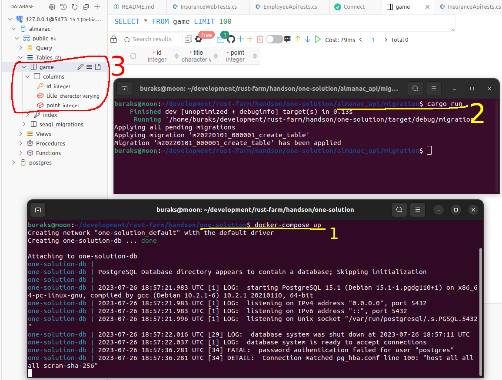
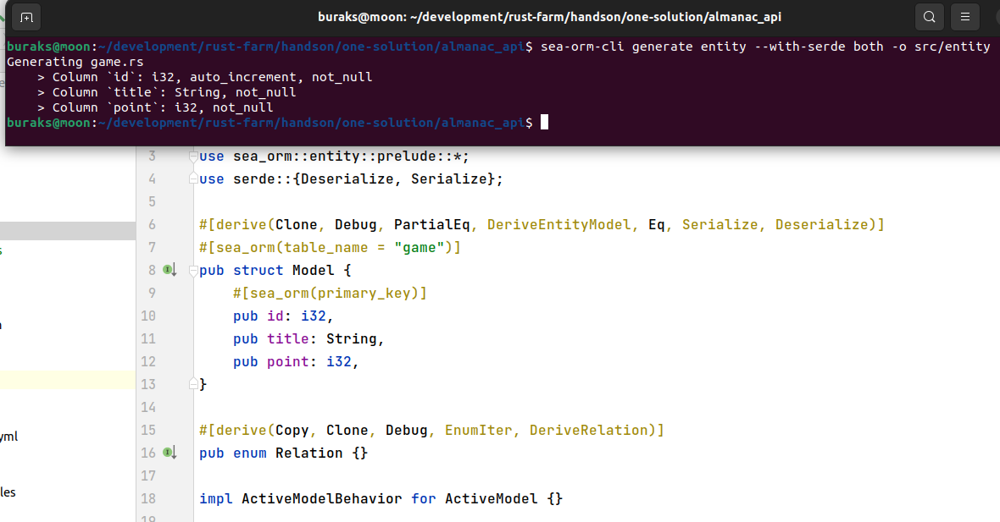

# Rust ile Bir Proje İskeletinin Oluşturulması

Microsoft .Net platformunda çalışanlar genellikle bir Solution ve altında toplanmış projelere aşinadır. Rust her ne kadar sistem programlama dili odaklı olsa da zaman zaman birden fazla rust uygulamasının bir arada yer aldığı siloların geliştirilmesi de söz konusudur. Özellikle servis odaklı yaklaşımlarda bunu sıklıkla görebiliriz. İşte bu çalışmadaki amaç bir Rust projeler topluluğunun tek çatı altında nasıl toplanabileceğini incelemektir. Konu ile ilgili olarak [şu medium yazı serisini](https://medium.com/@omprakashsridharan/rust-multi-module-microservices-part-3-database-808bfddae8a8) tatpik etmeye çalışıyorum. Her Hands-On'da olduğu gibi bunda da yol boyunca karşılaşacağım zorluklar olacağını biliyorum. Nitekim doğrudan yazıyı takip etmek yeterli değil, eksik kısımları github tarafından bakıp bulmak gerekiyor. Yine de öğrenecek, çözülecek bir sürü şey var. Süper :)

## Seyrüsefer

Yıldız tarihi 2023. Aynı workspace içerisine dahil olması planlanan rust projeleri için aşağıdaki işlemler yapılır.

```shell
# Root klasörü açıldı
mkdir one-solution
# İçerisine girilip Cargo.toml dosyası eklendi
# ki projeler ve ortak crate'leri içerecek
cd one-solution
touch Cargo.toml

# Örnek cargo kütüphaneleri ve uygulamaları açıldı

# veritabanı operasyonları
cargo new --lib almanac_data
# rabbitmq kuyruk işlemleri
cargo new --lib almanac_queue
# ortak kullanımlar
cargo new --lib almanac_common
# servis uygulaması
cargo new almanac_api
# analitik uygulaması
cargo new almanac_analytic
```

Projelerin açılması sonrası root klasörde yer alan cargo.toml dosyası da buna göre düzenlenmelidir. Bir Workspace oluşturulduğunda klasördeki hangi projelerin buraya dahil olduğu cargo.toml dosyasındaki workspace alanında belirtilir. Benzer şekilde tüm projelerin ortaklaşa kullanacağı crate'ler de buradaki workspace.Dependecies kısmına yazılır. İlk etapta root klasördeki cargo.toml dosyası aşağıdaki gibidir.

```toml
[workspace]
members = ["almanac_analytic","almanac_api","almanac_common","almanac_data","almanac_queue"]

[workspace.dependencies]
tokio = {version = "1.29.1", features = ["full"]}
serde = {version = "1.0.174", features = ["derive"]}
serde_json = "1.0.103"
thiserror = "1.0.44"
axum = "0.6.19"
tracing = "0.1.38"
tracing-subscriber = { version = "0.3.17", features = ["json","time","env-filter"]}

```

Şimdilik ihtiyaç duyulabilecek bazı küfeler eklendi. Asenkron operasyonlar için tokio, rest api tarafı için axum, hata yönetimini kolaylaştırmak için thiserror,yapılsal olay günlükleri için tracing, burayla etkileşim için tracing-subscriber, json serileştirme tarafları için serde ve serde_json gibi. İhtiyaç duydukça başka crate'ler de buraya eklenebilir ama genel itibariyle workspace'in oluşturulmasının esasları buradaki gibidir.

Serüven veritabanı operasyonlarını içeren almanac_data projesi ile devam ediyor. Burada daha önceden de kullanma fırsatı bulduğum sea-orm küfesi kullanılmakta. 

Bu projenin test fonksiyonu oldukça dikkat çekici. Solution esas itibariyle postgresql, apache kafka gibi unsurlar için docker-compose enstrümanını kullanmakta. Test fonksiyonundaki testcontainers enstrümanları Docker CLI ile konuşmak ve gerekli container'ları ayağa kaldırmak için kullanılmakta. 

Bu açıdan bakıldığında entegrasyon testlerinde de kullanıldığını ifade edebiliriz. Örnekte bir kuple postgresql'e bağlanıp basitçe SELECT 3.14 cevabını kontrol ediyoruz.

```shell
# root klasörde test çalıştırılması 
# workspace'e konu alan tüm testlerin çalıştırılmasını anlamına gelir
cargo test
```

_**Not:**_ Kendi Ubuntu sistemimde(22.04 versiyonu) testi yürütmek istediğimde **'failed to start container'** şeklinde bir hata aldım. Bunun sebebi docker CLI komutlarını sudo ile çalıştırabiliyor olmamdır. Dolayısıyla root user'ımı docker grubuna eklemem gerekti.

```shell
# eğer yoksa öncesinde bir docker grubu açmak lazım
# ki benim sistemde vardı
sudo groupadd docker

# sonrasında kullanıcımızı bu gruba eklemek gerekiyor
sudo usermod -aG docker $USER

# makineyi restart ettikten sonra testin çalıştığını gördüm
```

Sonraki bölümde Apache Kafka ile ilgili kodlamalar söz konusu ama oraya geçmeden önce temel gereksinimleri tamamlamayı düşünüyorum. Öncesinde Common ve WebApi taraflarını halledip sonrasında oyun ekleme, puan değiştirme gibi aksiyonların ele alınacağı asenkron kuyruk mekanizmasını entegre etmek niyetindeyim.

Common projesinde sadece birkaç event tanımı yer alıyor. Bir oyun eklendiğinde veya puanı değiştiğinde mesaj servisine gidecek verinin içeriğini tanımlıyorlar. 

WebApi projesinde ise işlemler biraz daha uzun. Öncelikle sea-orm ile migration hazırlıklarını yapmak gerekiyor.

```shell
# Daha önceden sistemimde sea-orm-cli yüklüydü 
# Deneyenler içinse aşağıdaki komutla yüklenebilir
cargo install sea-orm-cli
# ardından ilk migration planı aşağıdaki komutla oluşturulur
cd almanac_api
sea-orm-cli migrate init

# migration klasöründeki ilgili create_table dosyasını düzenlendikten sonra
# öncesinde docker container'ı ayağa kaldırıp
docker-compose up

# Ardından aşağıdaki komutlar ile migration planının çalıştırılması sağlanabilir
cd migration
cargo run
```



Koddaki data structure kullanılarak postgresql tarafındaki tablo oluşturuldu. ORM tarafındaki entity veri yapısının üretimi içinse aşağıdaki komutla ilerlenebilir.

```shell
# Bu komutu almanac_api klasöründe çalıştırmak gerekiyor
sea-orm-cli generate entity --with-serde both -o src/entity
```



Tam bu noktada atladığım bir şey olduğunu fark ettim. Oyunların title alanı unique olmalı. Bu ve benzeri farklılıklar için yeni migration planları oluşturup çalıştırmak mantıklı. Örnekte küçük bir değişiklik olsa da yeni migration planı nasıl hazırlanır göstermek açısından kıymetli.

```shell
# Web_api klasöründeyken 
sea-orm-cli migrate generate unique_title
# ardından
cd migration
cargo run
```


