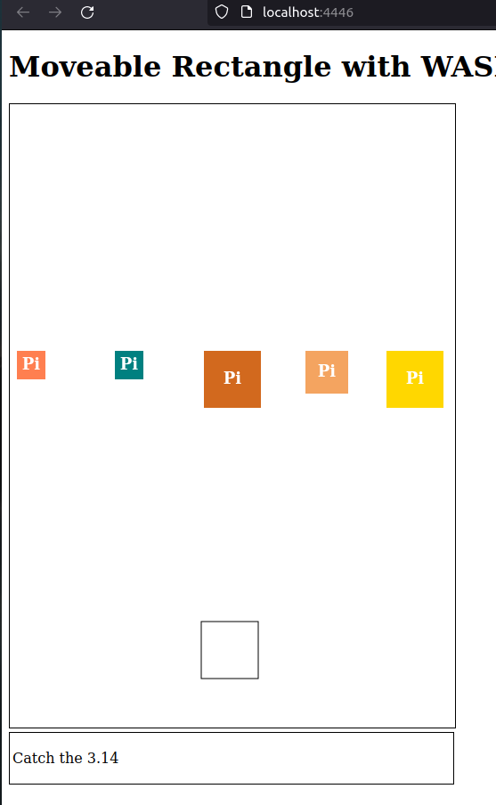

# Bir Başka Rust WASM Denemesi

Bu örnekte HTML 5'in SVG elementinden de yararlanarak sayfadaki bir dörtgenin yön tuşları ile hareket ettirilmesine bakıyoruz. Dörtgenin temel özelliklerini içeren veri modelini ve hareket sistemini Rust tarafında ele almaktayız. 

```bash
# wasm pack kurulumu için
cargo install wasm-pack

# WASM paketini hazırlamak için
wasm-pack build --target web
```

## Sunucu Yayınlama

Sayfayı dilersek basit bir node sunucusu üzerinden yayınlayabliriz. Bunun için aşağıdaki komutlarla ilerlenebilir.

```bash
# root klasördeyken
touch server.js

npm init -y

# Express modülü host işlemlerimizi kolaylaştırır
npm install express

# Örneği çalıştırmak için, yine root klasördeyken
npm start
```

## Çalışma Zamanı

Örnek çalışmaya başlatıldığında ile versiyonda aşağıdaki gibi bir çıktı olması beklenir.



Bundan sonrasında uygulama biraz daha oyunlaştırılabilir. Örneğin alt bölümde yer alan sorunun cevabını içeren bloğun oyuncu tarafından diğerlerine çarpmadan yakalanması sağlanabilir. Bu anlamada aşağıdaki değişiklikler düşünülebilir.

- Bloklar farklı ivmelerle insinler.
- Soru modülü eklensin. Aşağıdaki çıkan sorunun doğru cevabı tek bir blokta olsun, diğerleri hatalı cevaplar içersin.
- Oyuncu yanlış bloğu yakalarsa yansın, doğru bloğu yakalarsa oyun bir sonraki soruya geçsin.