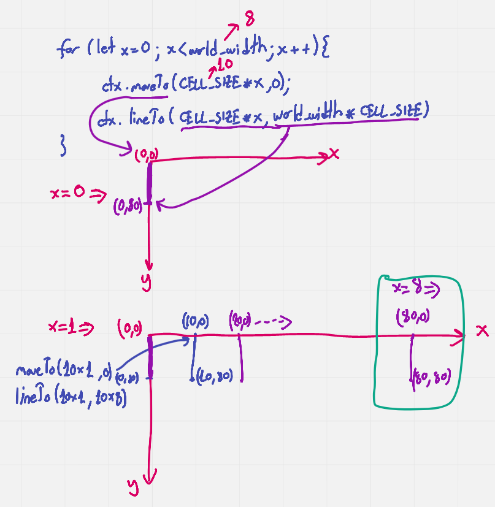
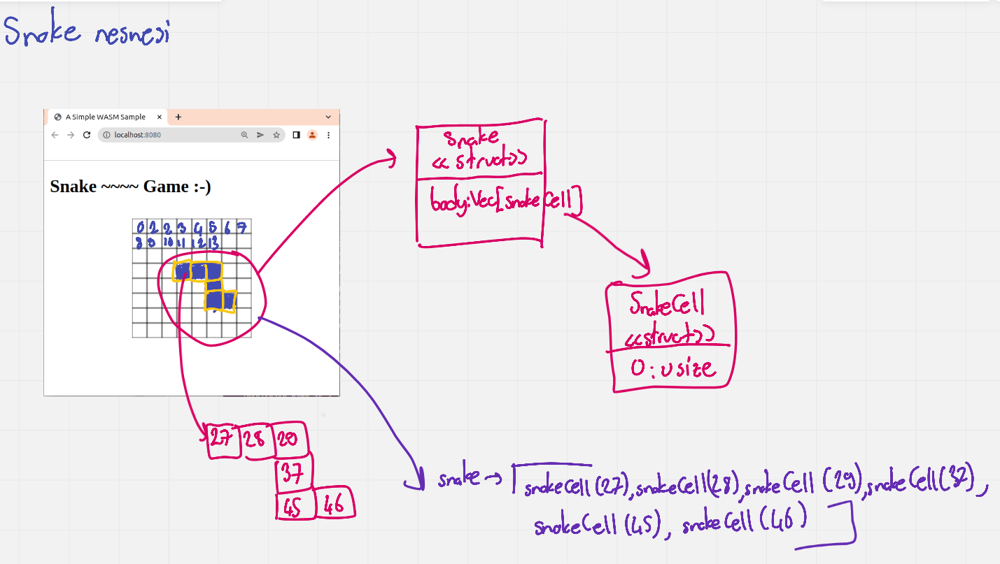
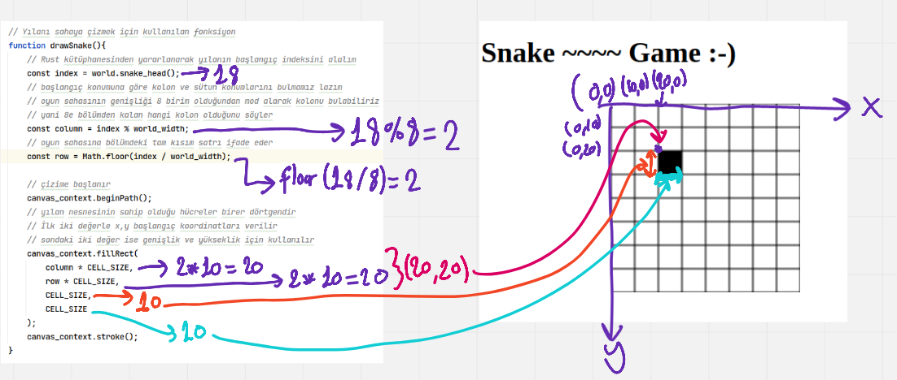
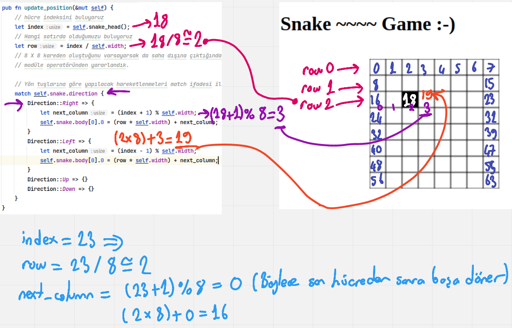
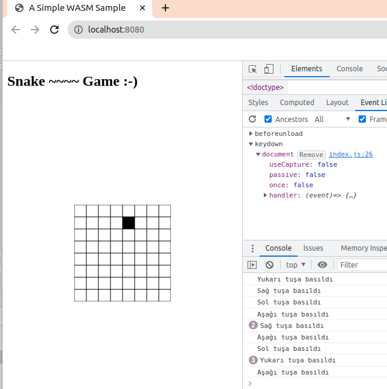

# Snake Game

Rust tarafında kod geliştirdikçe wasm paketini çıkmak gerekir.

```shell
wasm-pack build --target web
```

Web sunucusunu başlatmak içinse www klasöründe aşağıdaki komut çalıştırılır.

```shell
npm run dev
```

## Notlar

drawGameWorld fonksiyonunda yatay ve dikey eksen çizgileri çizidirilmekte. Buradaki döngüleri aşağıdaki grafikle açıklayabiliriz.

x eksenine göre dikey çizgilerin çizdirilmesi.



Yılan nesnesinin herhangibir t anındaki veri yapısına ait görüntü aşağıdaki gibi ifade edilebilir.



Başlangıçta yılanın ilk karesini çizen fonksiyonun görsel anlatımı aşağıdaki gibi ifade edilebilir.



Hücre sağa doğru hareket ettiğinde satır sonuna gelince yine aynı satırın 0ncı hücresinden başlamasının nasıl sağlandığının matematiği.



Yön tuşları için eklenen olay dinleyicisi iş başındayken tarayıcı loglarından bir görüntü.

