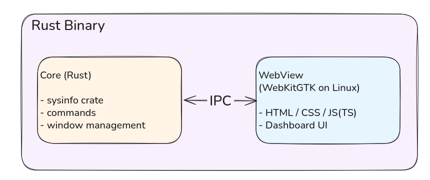
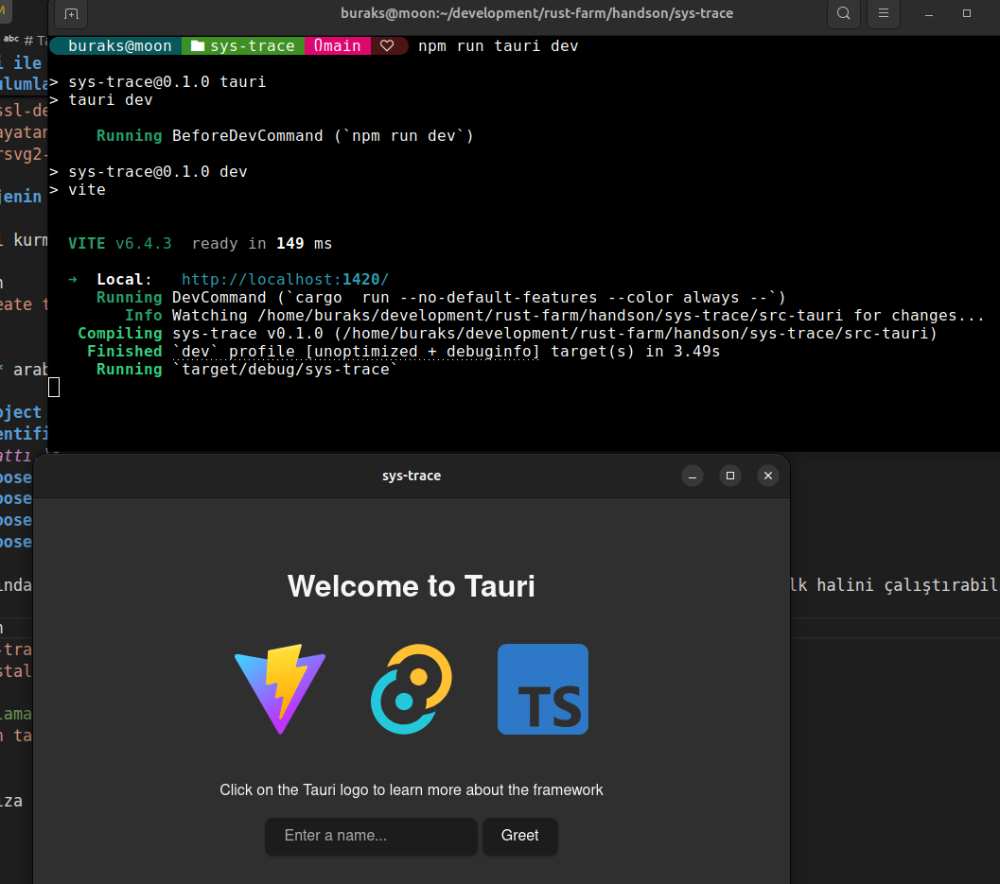

# Tauri ile Masaüstü Uygulama Geliştirme

Rust ekosisteminin popüler masaüstü uygulama geliştirme framework'lerinden birisidir. Bir Tauri uygulaması aslında tek bir process'te çalışan iki uygulamadan oluşur. Çekirdek fonksiyonellikler Rust tarafında ele alınırken önyüz tarafında WebView *(Linux tarafında WebKitGTK, Windows tarafında Edge WebView2 ve macOS tarafında WKWebView)* kullanılır. **Electron** ile kıyaslandığında ilk fark burada ortaya çıkar. Electron'da önyüz tarafında browser engine olarak Chromium kullanılır. Bu çalışmada Tauri ile bir masaüstü uygulaması geliştiriyoruz. Amacımız **sysinfo** küfesini *(crate)* kullanarak ilkel bir dashboard hazırlamak ve burada en azında CPU, RAM ve Disk kullanımını göstermek. Bu örneği göz önüne alırsak Tauri'nin çalışma prensibini aşağıdaki şekilde olduğı gibi özetleyebiliriz.



Önyüz ve arka plan uygulamaları arasında **IPC *(Inter Process Communication)*** mekanizması ile veri alışverişi yapılır. **REST** gibi network katmanına çıkılmayı gerektirecek bir iletişim söz konusu değildir. IPC'nin avantajlarını kullanır. WebKitGTK *(Windows tarafında WebView2 veya Mac OS tarafında WKWebView)* kullanıldığında zaten bundled browser yoktur. Önyüz için söyleyebileceğimiz önemli detaylardan birisi de işletim sistemine doğrudan temas etmemesi bunu Rust tarafından istemesidir. Bu iletişim **Command** ve **Event** enstrümanları üzerine kuruludur.

- Commands: Javascript veya Typescript tarafından **invoke** ile `tauri::command` direktifi ile işaretlenmiş Rust fonksiyonları çağırılabilir. Request/Response işleyişi her zaman asenkrondur.
- Events: Fire and forget mantığında one-to-many şeklinde bir iletişim söz konusudur. Rust tarafından `tauri::event::emit` ile event yayınlanabilir ve önyüz tarafında `window.listen` ile yakalanabilir.

Aradaki iletişimde hareket eden bilgiler JSON formatında serileşebilir olmalıdır. Bu da içeride `serde` küfesinin kullanıldığı anlamına gelir.

## Kurulumlar

Ben örnek çalışmayı Ubuntu 26.04 üzerinden gerçekleştirdim. Sistemimde zaten **Rust**, **Node.js** ve **npm** kurulu. Ancak bunların haricinde özellikle **Linux** tarafında `libwebkit2gtk-4.1-dev` paketinin kurulu olması gerekiyor. Bu paket WebKitGTK'nın geliştirme kütüphanesini içeriyor. Windows tarafında kullanılan WebView2 için ayrıca bir kurulum yapmaya gerek yok. Mac OS tarafında ise WKWebView zaten sistemin bir parçası.

```bash
# Öncelikle gerekli bazı ortam kütüphanelerini yükleyelim.
sudo apt update
sudo apt install libwebkit2gtk-4.1-dev \
    build-essential \
    curl \
    wget \
    file \
    libxdo-dev \
    libssl-dev \
    libayatana-appindicator3-dev \
    librsvg2-dev

# Tauri'nin kendisi Node'a ihtiyaç duymaz faka CLI scaffolding ve Vite dev server ihtiyaç duyar.
# Bu nedenle her ihtimale karşı uyumlu bir node versiyonu kurmakta fayda var. Ben nvm kullandım.
curl -o- https://raw.githubusercontent.com/nvm-sh/nvm/v0.40.1/install.sh | bash
source ~/.bashrc
nvm install --lts

# Hemen bir kontrol
node --version
```

- `libwebkit2gtk-4.1-dev` : WebKitGTK'nın geliştirme kütüphanesi. Bir başka deyişle uygulama için önemli olan WebView'ın ta kendisi.
- `build-essential` : Rust için C toolchain linker.
- `libxdo-dev` : X11 için mouse ve keyboard eventlerini simüle etmek için gerekli kütüphane.
- `libssl-dev` : OpenSSL kütüphanesi. Rust tarafında bazı kriptografik fonksiyonlar için gerekli.
- `libayatana-appindicator3-dev` : Linux tarafında uygulama ikonları için gerekli kütüphane. System tray desteği.
- `librsvg2-dev` : SVG ikonlarının render edilmesi için gerekli kütüphane. Tauri uygulamaları SVG ikonlarını kullanır.

## Projenin Oluşturulması ve İlk Gösterim

Projeyi kurmak oldukça basit. Scaffolding için Tauri CLI kullanıyoruz.

```bash
npm create tauri-app@latest
```

**CLI** arabirimi uygulama ile ilgili bize birkaç soru soracaktır. Bu soruları aşağıdaki gibi cevaplayabiliriz.

- **Project name**: sys-trace *(Bu benim verdiğim uygulama adı. Siz başka bir tane verebilirsiniz.)*
- **Identifier**: com.buraksenyurt.sys-trace *(Varsayılan olarak sunulanı kabul ettim. Bana biraz Java classpath mantığını hatırlattı.)*
- **Choose which language to use for the frontend**: Typescript
- **Choose your package manager**: npm
- **Choose your UI template**: Vanilla
- **Choose your UI flavor**: Typescript

Sonrasında uygulama klasörüne girip gerekli npm paketlerini yükleyebilir ve uygulamanın ilk halini çalıştırabiliriz.

```bash
cd sys-trace
npm install

# Uygulamayı çalıştıralım.
npm run tauri dev
```

Karşımıza aşağıdaki gibi bir pencere çıkması lazım.



> İlk çalıştırmada büyük ihtimalle Rust tarafı gerekli küfeleri yükleyecektir ve bu işlem birkaç dakika sürebilir. Sabırlı olun :D

## Proje İskeleti Hakkında Bilgi

Proje içeriğini şöyle değerlendirebiliriz. Tabii sonraki sürümlerde değişiklikler olabilir.

- `index.html` : Webview giriş noktası *(entry point)*.
- `vite.config.ts` : Tauri development server için Vite konfigürasyonu.
- `src` klasörü: Tamamen önyüz tarafı.
- `src-tauri` klasörü: Rust tarafı ve ayrı bir crate. Kendi `cargo.toml` dosyasına sahiptir. Dolayısıyla bu örnekte kullanacağımı **sysinfo** kütüphanesi burada eklenir.
- `src-tauri/capabilities` klasörü: Tauri uygulamasının hangi yetenekleri kullanacağını belirten manifest dosyaları. *(Permission grants)*
- `lib.rs` ve `main.rs` : İş kurallarımız burada yaşar.

Rust tarafında programın çalıştığı sistemden bazı bilgileri toplamak için kullanılan popüler küfelerden birisi **sysinfo** create'idir. Bunu `src-tauri` klasöründe aşağıdaki gibi yükleyebiliriz.

```bash
cd src-tauri
cargo add sysinfo --no-default-features --features system,disk
```

Rust tarafındaki geliştirmeler ile önyüz tarafı bittikten sonra çalışır bir örnekle karşılaşmış oldum. İtiraf etmeliyim ki doğduğumdan beri önyüz tarafında beceriksizim :D Neyse ki bu işi `GPT-5.3-Codex`' e devrettim. Ondan material design'a uygun makul bir arayüz çıkarmasını istedim. Sonuç ortada.

