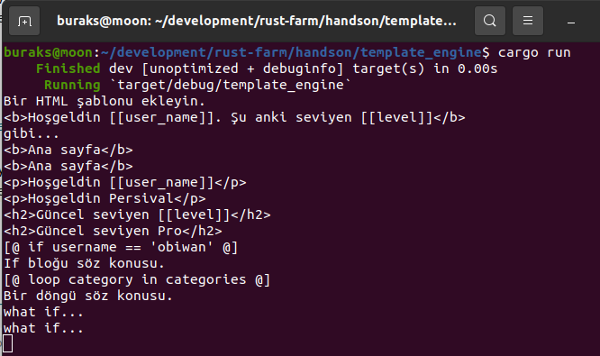

# Bir Template Engine Rust Dili ile Nasıl Yazılır?

Microsoft .Net tarafındaki bir Razor sayfasını düşünelim. Statik HTML elemanları haricinde @ operatörü ile başlayan ve aslında dinamik olarak çalışma zamanında çözümlenerek sonuç HTML çıktısını etkileyen faktörler de bulunur. Mesela aşağıdaki gibi

```csharp
@for (var i = 0; i < people.Length; i++)
{
    var person = people[i];
    <p>Name: @person.Name</p>
    <p>Age: @person.Age</p>
}
```

@for, @if @person.Name gibi kullanımlar dinamik olarak çözümlenebilen yapılardır. Template Engine'ler de statik ve dinamik içerikleri harmanlayıp istenen sonuç çıktısını vermek üzere tasarlanan yardımcılardır. Bu Hands-On çalışmasında basit bir Template Engine yazılmaya çalışılmaktadır.

Çalışma zamanına ait örnek bir çıktı.

```bash
cargo run
<b>Ana sayfa</b>
<p>Hoşgeldin [[user_name]]</p>
<h2>Güncel seviyen [[level]]</h2>
[@ if username == 'obiwan' @]
[@ loop category in categories @]
```



