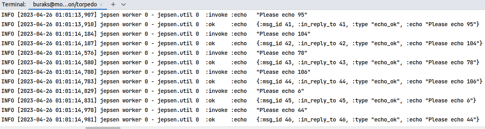
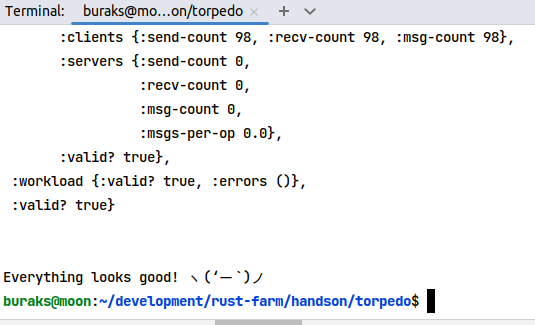

# Malestrom Distributed System Design Challenge

Malestrom'u ubuntu sistemimde ayağa kaldırmak için [şu adresteki adımları](https://github.com/jepsen-io/maelstrom/blob/main/doc/01-getting-ready/index.md) takip ettim.

## Çalışma Zamanı

```bash
# maelstrom nodunu yazılan terminal uygulaması ile çalıştırmak için
# malestrom'u home altına açtığım için aşağıdaki gibi çalıştırılabilir.
~/maelstrom/maelstrom test -w echo --bin target/release/torpedo --node-count 1 --time-limit 10
```

Echo challange bölümüne ait elde ettiklerim.




