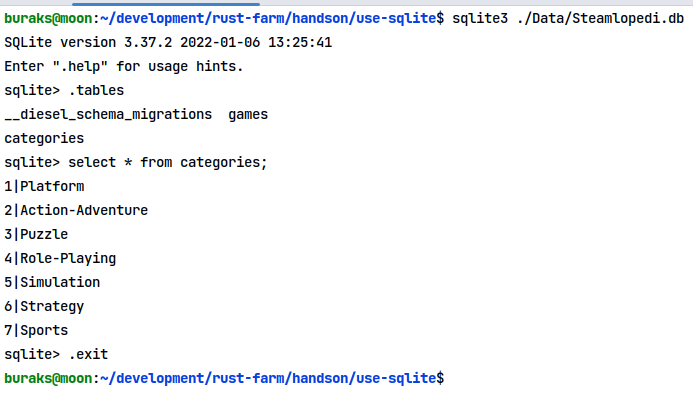

# Rust Uygulamalarında SQLite Kullanımı

Bu örnekteki amacım bir Rust uygulamasında SQLite kullanımını deneyimlemek. SQLite hafifsiklet bir veri tabanı olarak küçük boyutta veri kullanan terminal uygulamalarım için ideal görünüyor. SQLite ile Rust tarafındaki iletişim dışında Entity nesneleri ile ilgili işlemler veya migration operasyonları için de Diesel isimli crate'ten yararlanacağım. Örneği Ubuntu 22.04 sisteminde geliştirmekteyim.

```bash
# Sistemde SQLite yüklü olmalı elbette
sudo apt install sqlite3

# sonrasında kontrol için
sqlite3 --version

# diesel ile migration işlemlerini komut satırından yönetmek için
# cli arabirimine ihtiyacımız var
cargo install diesel_cli --no-default-features --features sqlite
```

Örnekte kullanılan crate'ler ise şöyle.
diesel ORM aracı, migration planlayıcı olarak kullanılıyor. dotenvy'yi ise .env dosyasından bilgi okumak için kullanıyoruz diyebilirim.
actix-web'i REST Api fonksiyonellikleri için kullanmaktayız. Serileştirme işlerinde ise serde devreye giriyor.

```text
[dependencies]
actix-web = "4.3.1"
#colored = "2.0.0"
diesel = { version = "2.0.4", features = ["sqlite"] }
dotenvy = "0.15.7"
serde = { version = "1.0.160", features = ["derive"] }
```

## Veritabanı oluşturma ve Migration İşleri

Diesel_cli aracını başarılı şekilde kurduysak aşağıdaki adımlarla devam edip ilk migration planını çalıştırabiliriz. Ancak öncesinde root klasörde .env uzantılı bir dosya açıp içerisine veritabanı bağlantı bilgisini yazmalıyız. Ben veritabanı dosyasını tutmak için Data isimli bir klasör oluşturdum ve .env dosyası içerisinde aşağıdaki içeriği kullandım.

```text
DATABASE_URL=./Data/Steamlopedi.db
```

Migration hazırlıkları için,

```bash
diesel setup
diesel migration generate initial_db
```

Bu komutlar migrations klasöründe tarih bilgisinin kullanıldığı bir klasör oluşturup içerisine up ve down isimli sql dosyalarını bırakır. Buraya yazılan SQL komutları migration upgrate ve downgrade operasyonlarında kullanılır. up.sql ve down.sql dosyalarını tamamladıktan sonra aşağıdaki komut ile migration planı işletilir.

```bash
diesel migration run
```

Terminalden tabloların oluşup oluşmadığını kontrol etmek için aşağıdaki işlemleri yapabiliriz.

```bash
sqlite3 ./Data/Steamlopedi.db
.tables
select * from categories;
.exit
```



Migration başarılı şekilde işledikten sonra tablolar ile ilgili Entity bilgileri de schema.rs içerisinde otomatik olarak oluşur.

### Not: 
- Migration planının çalıştırdığımda primary key alanları için schema dosyasına Nullable<integer> tipi atandı. Bu çok basit bir rust sorgusunun bile _ the trait `load_dsl::private::CompatibleType<Category, Sqlite>` is not implemented for `(diesel::sql_types::Nullable<diesel::sql_types::Integer>, diesel::sql_types::Text) şeklinde hata vermesine neden oluyordu. Schema dosyalarını elle düzelterek, yani Nullable<integer> tiplerini integer'a çekere şimdilik sorunu çözdüm ancak migration plan tekrar çalıştırıldığında bu tipler ezilecektir. Daha kalıcı bir çözüm bulmam lazım.
- Bir diğer ilginç durumda şuydu. Model nesneleri ile otomatik üretilen şema nesnelerindeki alanların sıraları hatalı olduğunda program derlenmiyordu.

## Testler

Uygulama actix-web ile REST api'ye çevrildikten sonra aşağıdakiler denenebilir.

```text
Tüm Kategoriler
HTTP Get
http://localhost:5232/categories

Tüm Oyunlar
HTTP Get
http://localhost:5232/games

Yeni Oyun Ekleme
HTTP Post
http://localhost:5232/games
Body
{
    "category_id": 6,
    "title": "Civilization II",
    "stars": 9
}

Oyun Silme (Adından parametre değeri geçenleri topluca siler)
HTTP Delete
http://localhost:5232/games/Civilization II

Oyun Bilgilerini Güncelleme
HTTP Put
http://localhost:5232/games
Body
{
    "id":20,
    "category_id": 6,
    "title": "Civilization II",
    "stars": 8
}
```

Postman dosyasına [buradan](Actix-Web%20use-sqlite%20%5BRust%5D.postman_collection.json) erişebilirsiniz.