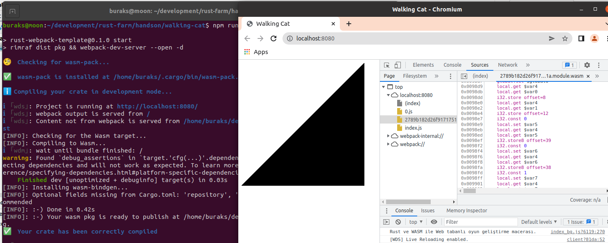

# Bir Rust Web Assembly Denemesi

Web tabanlı oyun geliştirmede Rust ile Web Assembly işbirlikteliğini öğrenmek için kullanılabilecek bir başlangıç setidir.

## Sistem Hakkında Bilgi

Örnek Ubuntu 20.04 üzerinde geliştiriliyor. rust ortamı kurulu. Ayrıca node.js *(En nihayetinde bir web uygulaması söz konusu)* ve npm de yüklü.

### Proje İskeletinin Oluşturulması

```shell
#1 Proje Klasörü Açılır
mkdir walking-cat
cd walking-cat

#2 Rust Wasm grubunun hazırladığı Rust Webpack şablonu yüklenir
npm init rust-webpack
npm install

#3 Sunucu başlatılır
npm run start

# Sistemde yüklü değilse wasm-pack ile ilgili bir hata alınabilir
# Bu durumda https://rustwasm.github.io/wasm-pack/installer/ adresine gidip
# gerekli kurulum talimatlarını izlemekte yarar vardır

#4 cargo.toml içerisindeki bağımlılıklara ait versiyonlar güncellenir
#Örnekte rust için 2021 sürümü ele alınmıştır.
```

**Kod değişiklikerinde de #İşlemSırası notasyonu kullanılacak**

#6ncı kodlama sonrası çıktı örnek çıktı.



## Notlar

- wasm-bindgen hakkında: WebAssembly'ın kısıtlarından birisi DOM *(Document Object Model)* doğrudan erişememesidir. Bu nedenle WebAssembly içinden web sayfasındaki elementlere erişim Javascript fonksiyon çağrıları ile mümkün olabilir. Lakin bunun için de WebAssembly ile Javascript paylaşımlı bellek bölgesi kullanır ve WASM tarafında Javascript tarafına giden nesneler byte olarak gönderilir *(Marshalling)* Çok doğal olarak bu zahmetli bir iş. wasm-bindgen isimli crate bu noktada bir köprü vazifesi görür ve işleri kolaylaştırır.
- web-sys hakkında: wasm-bindgen WASM tarafından yapılan Javascript çağrılarını oldukça kolaylaştırır. Diğer yandan tarayıcıların hali hazırda sahip olduğu pek çok built-in fonksiyon da vardır. Tarayıcıda konsola log bırakmak için kullanılan console.log bunlardan birisidir. web-sys isimli crate bu tip fonksiyonların rust tarafından kolayca kullanılmasını sağlamaktadır.

