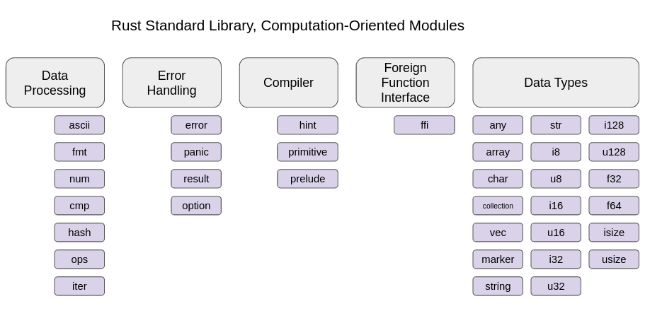
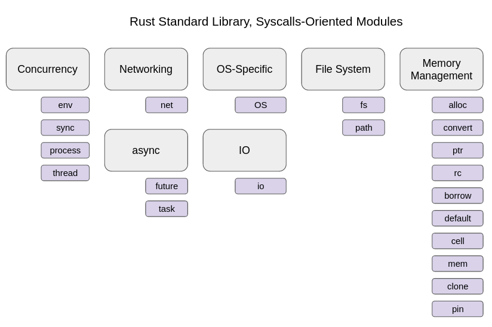
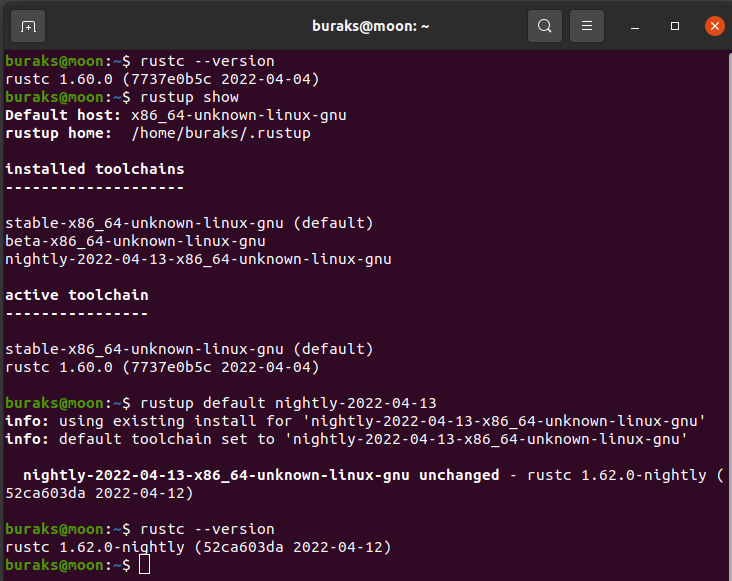
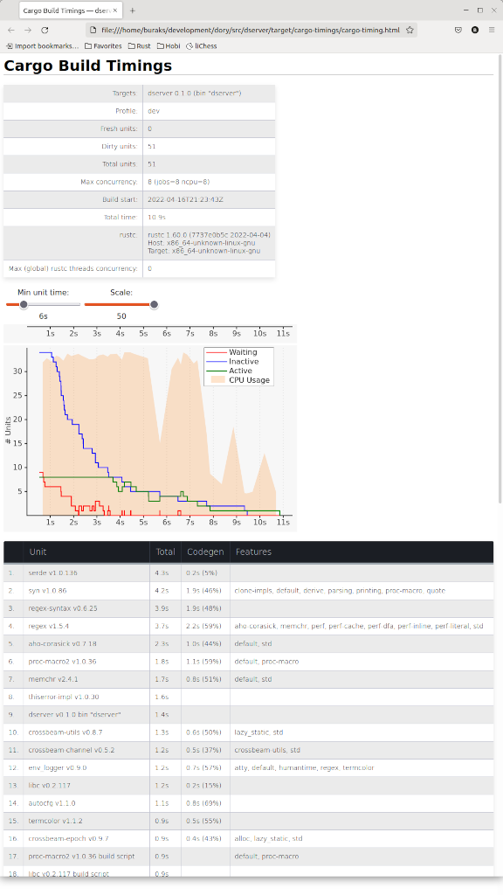
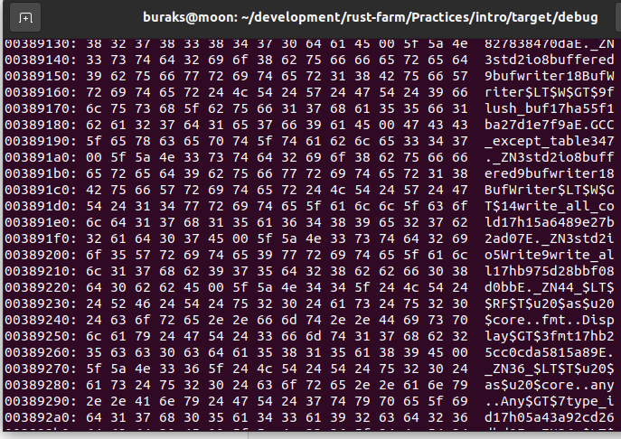

# Sağdan Soldan Defterlerime Aldığım Bazı Notlar

Rust dilini öğrenmek ve etkili şekilde kullanabilmek için pek çok kaynaktan yararlanıyorum. Cuma günleri düzenli olarak bülten gönderen [This Week in Rust'tan](https://this-week-in-rust.org/) Amazon'dan aldığım kitaplara, Udemy eğitimlerinden kişisel web sitelerine kadar birçok kaynak...Bazen bu kaynaklardan yakaladığım bilgileri defterlere not aldığımı fark ettim. Deftere not almak o kadar da teknolojik sayılmayan ama etkili bir öğrenme yöntemidir aslında. Bu dokümanda ilgili notları tekrar etmek ve bir düzene koymak açısından oluşturuldu.

- cargo.toml, bir rust projesinin kendisi ve bağımlılıkları hakkında çeşitli bilgiler tutar. Dosyanın içeriği kolayca okunabilir bir formattadır ve yorum satırların eklenmesine de izin verir niteliktedir. TOML'ın açılımı ise [Tom's Obvious, Minimal Language](https://en.wikipedia.org/wiki/TOML) 'tir. Yazarın adı Tom Preston-Werner.
- Rust'ın ilgi çeken yazımlarından birisi **Turbo Fish** olarak adlandırılıyor. **::<>** şeklindeki bu yazımda <> balığı, :: ise o hızla ilerlerken arkasında bıraktığı kabarcıkları ifade etmekte :D
- String::new(); heap'te bir referans açar. Ayrıca String, **Smart Pointer**'dır.
- Ownership kuralları:
  - Bir değer *(value)* tek bir değişken *(variable)* tarafından sahiplenilir.
  - Değişken sahibi scope dışına çıktığında tuttuğu değe yok olur *(deallocate)*
  - Bir t anında sadece tek bir sahip *(owner)* olabilir.
- Double Free, memory corruption'a yol açan bir durumdur. Aynı değere refere eden iki String değişken düşünelim. Scope sonlanırken kurallara göre her ikisi de deallocate edilmeye çalışılır. Bu durum Double Free olarak adlandırılıyor. Rust buna göre bir değerin sahipliğinin tek bir değişkende olmasını garanti eder. Örneğin aşağıdaki input değerinin sahipliği s'de olduğu için derlenmez.

```rust
use std::io;

#[allow(unused_variables)]
fn main() {
  let mut input=String::new();
  let mut s=input;  // The ownership of the string is moved to the variable s
  io::stdin().read_line(&mut input);
}
  ```
- Rust dilinde tüm string'ler UTF8 formatındadır. Dolayısıyla bir karakter veri 1 byte'tan fazla yer tutabilir. Bunun sebebi Unicode kullanımıdır. Örneğin emojiler, japon harfleri. Buna göre aşağıdaki kod farklı çalışır.

```rust
fn main() {
    let emojis=String::from("🍔🍟🍨🍯");
    let slice=&emojis[..4];
    println!("{}",slice); // Sadece 🍔 döner
    let slice=&emojis[..8];
    println!("{}",slice); // 🍔🍟 döner
}
```

- Tüm dosya ve klasörler **module**'dür. Rust projesinin kendisi ise **crate** olarak adlandırılır. Rust proje hiyerarşisinde birden fazla dosya olabilir ki her biri birer module'dür. Ayrıca bu dosyalar klasörler içinde yer alabilir ki bu klasörler de ayrıca module'dür. Dosya veya klasör şeklindeki bir modülü uygulamada kullanmak istediğimizde mod anahtar kelimesini kullanırız. Bazen klasörler içinde gördüğümüz **mod.rs** dosyasının bir kullanım amacı o klasörden public olarak açılacak diğer enstrümanların tanımlandığı yer olmasıdır.
- Bulunduğumuz modülden bir üst modüle ulaşmak istediğimizde **super** operatörünü kullanabiliriz. Bazen de **crate::** şeklinde kullanımlara rastlarız. **crate**, bulunduğumuz projenin root module'ünü işaret eder.

```rust
mod http {
  mod request {
    use super::method::Method; // http modülüne çık, oradan method'a geç, oradan da public Method enum tipine ulaş gibi.
    struct Request {
      
    }
  }

  mod method {
    pub enum Method {}
  }
}
```
- Her dosya esasında bir module'dür demiştik. Yani server.rs şeklinde bir dosya açmak, mod server şeklinde bir module açmakla aynı şeydir. Ayrı bir dosya açtığımızda genellikle main fonksiyonunun olduğu yere de mod bildimi yapılır. Yani server.rs için main.rs içinde **mod server;** şeklinde bir tanım eklenir. Sebebi nedir biliyor musunuz? Derleyici, **mod server;** yazan yeri mod server { } olarak kabul edip içeriğini server.rs içeriği ile doldurur. Sanki önyüzde app bileşeni içerisinde diğer bileşenleri tag olarak eklemek gibidir.
- Örnek bir klasör yapısı ile modül kullanımına bakabiliriz.
```text
server
--->src
--->main.rs
--->server.rs (module)
--->tcp (module)
------>package.rs (sub module)
------>parser.rs (sub module)
------>mod.rs
```
- Rust, exception handling gibi bir mekanizma içermez. Bunun yerine olası tüm durumların değerlendirilmesini ister. Result<T,Err> ile **recoverable** hataların kontrolünü ele alabiliriz. Birde kurtarılamayan **unrecoverable** ve programı sonlandıran hata durumları vardır. Rust her iki durumu ayrı ayrı ele alırken pekçok dilde hepsi aynı istisna yönetimi mekanizması ile kontrol edilmeye çalışılır.
- Sonsuz döngülerde label kullanarak break çağrısı sonrası nereye sıçrayacağımızı söyleyebiliriz.

```rust
fn main() {
  'outer: loop {
    'inner: loop {
      break 'outer; // outer olarak isimlendirilmiş loop'a sıçramamızı sağlar.
    }
  }
}
```

- Bir rust programının çalıştığı klasörü platform bağımsız bulabiliriz. Bunun için env! makrosundan ve geçerli bir parametreden yararlanırız. Bu sayede örneğin çalıştığı yerdeki bir klasörü de ele alabiliriz. Mesela bir web server yazdığımızı düşünelim. static dosyaların olduğu path'e ulaşmak için bu yolu kullanabiliriz.

```rust
use std::env;

#[allow(unused_variables)]
fn main(){
  // let default_path=env!("CARGO_MANIFEST_DIR");  
  let default_path=format!("{}/public",env!("CARGO_MANIFEST_DIR"));
  // Envrionment ile public_path tanımı yapılmışsa kullan yoksa default_path'i kullan
  let public_path=env::var("PUBLIC_PATH").unwrap_or(default_path);
}
```

- Rust, Referans içeren struct türlerinden açık bir şekilde _(explicitly)_ lifetime belirtilmesini ister. Öyle ki rust ortamında tüm referansların bir yaşam ömrü vardır.
- Rust'ın memory safety ve thread safety konusunda uyguladığı kurallar aşağıdaki durumların oluşmasını engeller. Üstelik bunlar derleme zamanında tespit edilir.
  - Data races : İki veya daha fazla thread'in eş zamanlı olarak aynı veriye erişmesi ve thread'ler den en az birisinin mutation halinde kalması durumunda oluşur.
  - Dangling pointers : Aynı veri bölgesini işaret eden iki referanstan ilki deallocate olduktan sonra boşalan veri bloğunu işaret etmeye devam eden diğer refaransa verilen isimdir.
  - Use after free : Referans edilen bir bellek bölgesinin serbest bırakıldıktan sonra kullanılmaya çalışılması halidir.
  - Double free : Aynı pointer için birden çok defa serbest bırakma _(free)_ operasyonu icra edilmesi durumudur.
  - No pointer dereferences :
  - Buffer overflows : 
- Ödünç alma _(borrowing)_ kurallına göre n tane immutable referans ödünç alımı mümkünken herhangi bir t anında sadece 1 tane değiştirilebilir _(mutable)_ referans ödünç alınabilir. Bu sayede data races ihlallerinin önüne geçilir.

```rust

fn main() {
  // n tane immutable mümkündür
  let mut input = String::new();
  let s1=&input;
  let s2=&input;
  println!("{},{}",s1,s2);
  
  // Derlenmez!
  // let mut s1=&mut input;
  // let s2=&input;
  
  // Bu da derlenmez!
  // let mut s1=&mut input;
  // let mut s2=&mut input;
}
```

- Rust, C dilindeki gibi belleğin verimli, düşük maliyetli kullanımı ile yüksek performans ve Java'da ki gibi memory safe bir ortamın oluşmasını garanti edecek şekilde tasarlanmış bir derleyici kullanır.
- 2006 yılında Mozilla çalışanlarından Grayon Hoore tarafından kişisel bir proje olarak başlamıştır. 2010'da Mozilla'nın bir araştırma projesi haline gelir. 2015 yılında Rust 1.0 sürümü yayınlanır. 2020'de Mozilla'dan [Rust Foundation'a](https://foundation.rust-lang.org/) geçer ki bu konsorsiyumun kurucu ortakları AWS, Google, Huawei, Microsoft ve elbette moz://a' dır.
- Amazon tarafından yapılan [bir araştırmaya göre](https://aws.amazon.com/tr/blogs/opensource/sustainability-with-rust/) enerji tüketimi ve işlem süreleri açısından en verimli diller arasında C'den sonra 2nci sırada gelmektedir. Bu anlamda Java, Go, C#, Python gibi yüksek seviyeli dilleri geride bırakmıştır.
- Trait'ler nesneler arasında fonksiyon paylaşımının bir yoludur ve diğer dillerdeki interface türüne oldukça benzerler.
- Rust'ta standart hata yönetiminde Result tipi kullanılır. Result sonuçlarını pattern matching ile kontrol altına alabiliriz. Unwrap fonksiyonu ile doğrudan Result sonucu alınır ama hata oluştuysa program çöker. Bu yüzden çok tercih edilmemelidir. ? operatörü ile Result bir hata içeriyorsa kolayca yakalanır lakin ?'in olduğu fonksiyonun hata nesnesini döndürmesini gerektirir.

```rust
fn main() {
    // Klasik yol
    match work_result {
        Ok(r) => do_something(r),
        Err(e) => handle_error(e)
    }  

    // Option gibi Unwrap kullanımı. Lakin hata varsa program çöker
    process_result.unwrap()
}

// ? operatörü ile
fn apply() -> MyError {
    do_something()?;
}
```

- Modül bildirimlerinde modül içerisindeki enstrümanlara daha kolay ulaşmak için *prelude* standardı kullanılabilir. Örneğin,

```text
mod db;
mod prelude{
  pub use somelib::prelude::*;
  pub const WIDTH:i32=80;
  pub const HEIGHT:i32=50;
  pub use crate::db::*;
}
use prelude::*;

fn main(){ 
}
```

- Modüller ağaç yapısı şeklinde organize olurlar. *crate::* ifadesi ile root modüle çıkılır. Toml dosyasına sahip her tür rust örneği bir *crate* dir.
- *cargo run* çağrımı arkasından kendi komut satırı argümanlarımızı göndermek istersek rust'ın diğer komut satırı enstrümanları ile karışmamaları için *--* ifadesinden yararlanabiliriz. *cargo run -- -silent -on* gibi
- cargo aracı modülleri paralel olarak derleyebilir.
- Pek çok dilde tek bir string türü vardır. Rust'ın iki string türü ile ilgilendiğini söyleyebiliriz. Birisi kendi değerine sahip çıkan ve heap'i kullanan String, diğeri de bir String içeriğindeki parçaları ifade edebilen referans string, yani &str.
- Rust Standard Library *(std olarak kısaltabiliriz)* işletim sistemi içerisinde sistem çağrıları yapmak için *(syscalls)* libc veya muadili bir aracı kullanır. Doğrudan sistem fonksiyonları da çağırabilir. Ayrıca 1.59.0 sürümü ile birlikte [assembler kodlarını çalıştırmak](https://blog.rust-lang.org/2022/02/24/Rust-1.59.0.html) da mümkündür.
- Rust Standard Library platform bağımsızdır.
- Rust Standard Library içerisindeki modüller **Syscalls-Oriented** ve **Computation-Oriented** olarak iki gruba ayrılır.
  - **Syscalls-Oriented:** Sistem donanımı ve kaynaklarını doğrudan yönetmek için kullanılan modülleri içerir.
  - **Computation-Oriented:** Verinin gösterimi, modellenmesi, işlenmesi, hata yönetimi, temel veri türleri gibi modülleri içerir.





- Rust'ın **array** veri yapısı **value-type** türündendir ve stack bellek bölgesinde sabit uzunlukta olacak şekilde kullanılır.
- Bir fonksiyona gönderilecek parametre derleme zamanında belli değilse **any** tipi kullanılabilir.
- isize ve usize tipleri 32 bit sistemlerde 32 bit(4 byte), 64 bit sistemlerde ise 64 bit(8 byte) uzuğunluğundadır.
- Bellek yönetimi denilince şunları düşünebiliriz;
  - static memory allocation *(stack)*
  - dynamic memory allocation *(heap)*
  - memory deallocation *(bir değişkenin scope dışına çıkması sonrası destructor'un çalışması)*
  - clone, copy işlemleri
  - raw ve smart pointer'ların yönetimi
- Rust dilinde raw pointer'lar çok sık kullanılmazlar. Mutable ve immutable tanımlanabilirler ve mutlaka unsafe kod blokları içerisinde ele alınırlar. Dolayısıyla derleyici bellek güvenliğinin sorumluluğunu üstüne almaz, bunu programcıya bırakır.
- Bazen nesnelerin bellekteki sabit lokasyonlarda kalmasını ve hiçbir şekilde taşınmamasını *(move)* isteyebiliriz. Kendisini referans eden bağlı listeler'de *(Linked List)* olduğu gibi. Bu gibi durumlarda için Rust, *Pin<P>* veri tipini sunmaktadır. 
- Rust dilinde versiyonlama Major.Minor.Patch formatında yapılır. 1.4.12 gibi. Büyük değişikliklerde Major sürüm artar. Yeni fonksiyon veya özelliklerin eklenmesinde ise Minor sürüm artar. Var olan sürümdeki bug fix'ler için Patch versiyonu artırılır. Yeni bir minor versiyon çıkılması halinde patch değeri de sıfırlanır. Yani 1.2.3 şeklindeki bir sürüme yeni özellikler eklendiyse yeni sürüm 1.3.0 olacaktır.
- Bir rust kütüphanesini crates.io'ya alırken TOML dosyasında mutlaka olması gereken bazı bilgiler vardır.
  - authors: yazar bilgileri
  - description: ürünün ne yaptığı hakkında kısa bir açıklama.
  - homepage: ürüne ait web sayfası *(en kötü ihtimalle github adresi)*
  - repository: kaynak kodun yer aldığı github reposu
  - readme: projede bir Readme.md dosyası olmalıdır.
  - keywords: ürünü sınıflandıran takılar *(tag)* için
  - categories: ürünün dahil olduğu kategori/kategoriler *(crates.io dakiler kullanılabilir)*
  - license : MIT or Apache 2.0 gibi bir lisanslama bilgisi. Lisanlama var ise proje kaynak klasöründe COPYING dosyası ve license klasörü ile içeriği de olmalıdır.
  - Bir rust projesinde birden fazla binary kullanmak istersek kaynak dosyaları src/bin klasörü altında toplamamız yeterlidir.
  - Rust'ın stable, beta ve nightly sürümleri arasında kolayca geçişler yapılıp istenilen sürüm ile çalışılabilir.
  
```shell
# stable sürümü yüklemek için
rustup install stable
# beta sürümünü yüklemek için
rustup install beta
# nightly build sürümlerden yüklemek için
rustup install nightly
# hatta belli bir günün nightly sürümünü yüklemek için
rustup install nightly-2022-04-13

# Belli bir sürüme geçmek için rustup default nightly

# Var olan sürümü güncellemek için
rustup update

# Güncel sürümü öğrenmek için
rustc --version

# mevcut sürümleri görmek için
rustup show
```



- Rust'ın 1.60.0 sürümü ile birlikte build işlemlerine ait bazı ölçümleri gösteren bir cargo parametresi eklendi.

```shell
cargo build --timings
```

Bu çalıştırma işlemi sonrasında cargo-timing bilgilerini içeren html dosyaları target/cargo-timings klasörü altına atılıyor.



- Bir rust binary'sinin bellek görüntüsüne bakmak için xxd aracından yararlanılabilir. intro klasöründe yer alan basit örnek için;

```shell
cargo build
cd target/debug
xxd -g1 intro
```



- Her rust programı bir process olarak açılır ve işletim sistemince sağlanan bir sanal bellek alanına yerleşir. JVM, V8 ve Go'nun bellek kullanım tasarımları ile karşılaştırıldığında generational veya karmaşık alt yapılardan oluşmaz. Bir GC mekanizması yoktur ancak bellek yönetimi için Ownership, Resource Acquisition is Initialization *(RAII)*, Borrowing & Borrow Checker, Variable Lifetimes ve Smart Pointers kullanır.
- Derleme zamanında boyutu tahmin edilemeyen her veri heap'te tutulur = *Dynamic Data* Ancak istersek sabit uzunlukta veriler için Box<T> smart pointer'ını kullanarak Heap üstünde de yer ayrılmasını *(allocation)* sağlayabiliriz.
- Veri boyutları derleme zamanında bilinen veriler stack üstünde durur. Thread başına bir Stack söz konusudur. Fonksiyon çerçeveleri *(Function Framews)*, primitive tipler, struct veri türü ve pointer'lar burada durur.